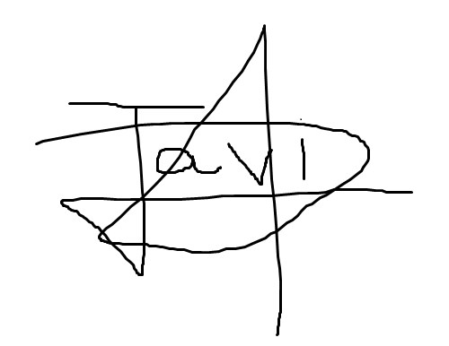
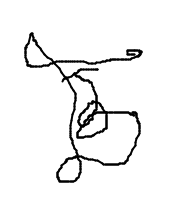
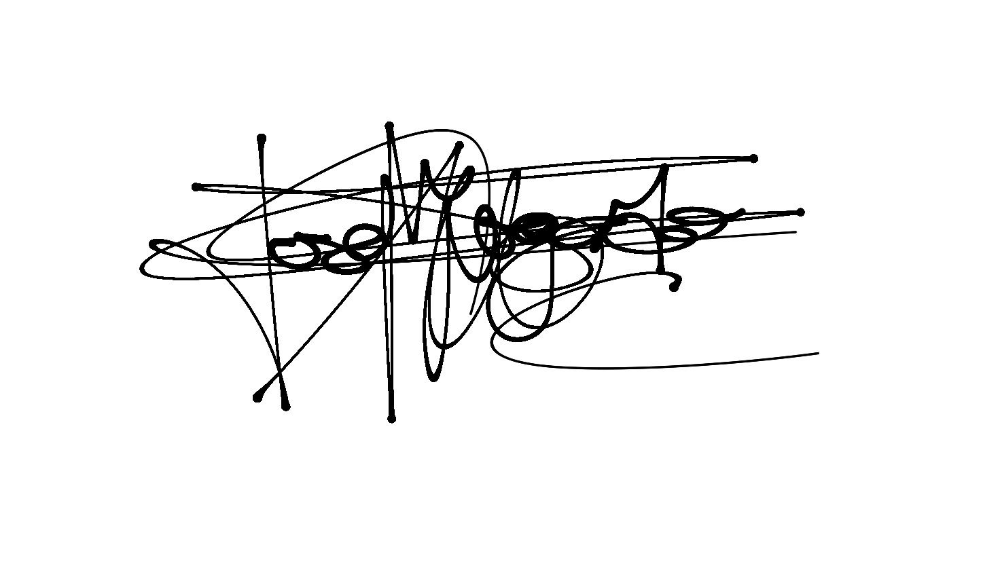
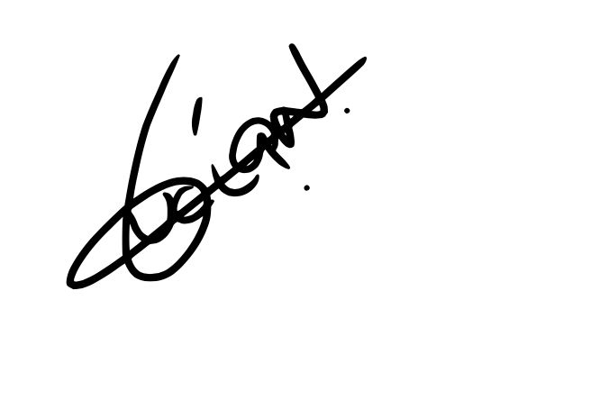
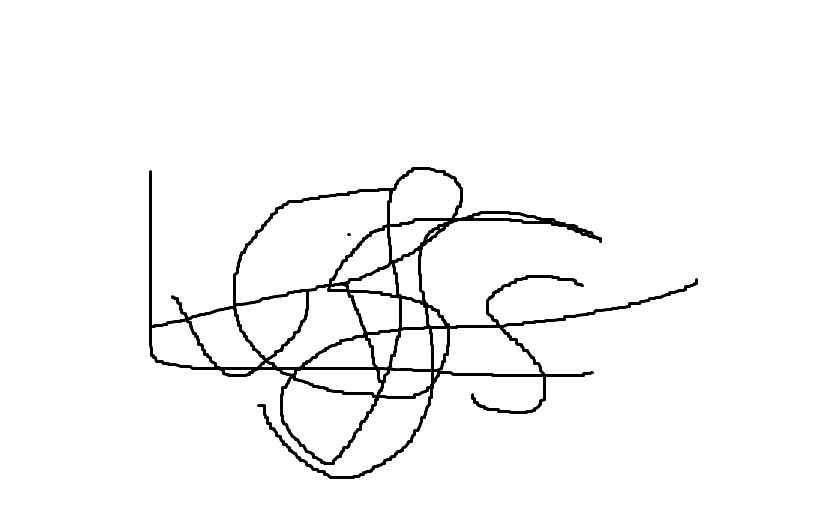

# Commitment Agreement

**Fecha:** 18/02/2025
**Grupo 8:** Infantem
**Sprint 1**

## Integrantes del Grupo

- Álvaro Jiménez Osuna
- Ángela López Oliva
- Antonio Jiménez Ortega
- Daniel del Castillo Piñero
- David Fuentelsaz Rodríguez
- David Vargas Muñiz
- Enrique García Abadía
- Felipe Solís Agudo
- Javier Santos Martín
- Javier Ulecia García
- José García de Tejada Delgado
- Jose Maria Morgado Prudencio
- Josué Rodríguez López
- Lucía Noya Cano
- Luis Giraldo Santiago
- Miguel Galán Lerate
- Paula Luna Navarro

**Contribuyentes**
Álvaro Jiménez Osuna
Ángela López Oliva
Antonio Jiménez Ortega
Daniel del Castillo Piñero
David Fuentelsaz Rodríguez
David Vargas Muñiz
Enrique García Abadía
Felipe Solís Agudo
Javier Santos Martín
Javier Ulecia García
José García de Tejada Delgado
Jose Maria Morgado Prudencio
Josué Rodríguez López
Lucía Noya Cano
Luis Giraldo Santiago
Miguel Galán Lerate
Paula Luna Navarro

## Colaboradores del documento
- David Fuentelsaz Rodríguez
  - Creó la versión inicial del documento
- Todos los miembros de equipo
  - Firmar Commitment Agreement

---

## Índice

1. Compromiso
2. Resolución de Problemas
3. Políticas Organizacionales
   1. Documentación de Procesos y Comprensión Colectiva
   2. Imagen Corporativa Consistente
   3. Respeto por Roles y Responsabilidades
   4. Transparencia y Comunicación
   5. Cumplimiento de Plazos y Entregas
   6. Política de Capacitación Continua
   7. Gestión de Recursos
   8. Gestión de Riesgos
   9. Evaluaciones Periódicas del Desempeño
   10. Promoción de la Inclusión y Diversidad
   11. Política de Reuniones
4. Sistema de Evaluación Periódica de los Miembros
   1. Dedicación y Esfuerzo
   2. Calidad del Trabajo
   3. Trabajo en Equipo
   4. Asistencia a Reuniones
   5. Adherencia a Políticas
5. Recompensas y Penalizaciones
6. Condiciones para la expulsión del grupo
7. Firma del Alumno
   1. Miembros del Equipo

---

## Compromiso

Al incorporarse a la asignatura de Ingeniería de Software y Práctica Profesional (ISPP) para el curso 2024-25, el miembro del equipo se compromete a cumplir con los siguientes requisitos y condiciones como miembro activo del grupo de trabajo, compuesto por 17 personas:

- **Dedicación de Tiempo:** El miembro se compromete a dedicar un esfuerzo de 10 horas semanales a las actividades y tareas asignadas en el marco de la asignatura, incluyendo la asistencia a clase.
- **Asistencia a reuniones:** El miembro se compromete a asistir a reuniones periódicas semanales establecidas los jueves y sábados con el objetivo de mantener un seguimiento continuo del proyecto. En caso de no poder asistir por causa mayor, justificará su ausencia al grupo y leerá detenidamente el acta correspondiente para estar al tanto de los temas tratados en la reunión.
- **Esfuerzo:** El miembro se compromete a retirarse voluntariamente del grupo para no obstaculizar el progreso de este si su esfuerzo no alcanza al menos el 50% de las horas asignadas al hito para el que se está trabajando ni si sus tareas y objetivos asignados no han sido cumplidos.
- **Finalización de Tareas:** El miembro se compromete a finalizar sus tareas asignadas los miércoles de cada semana, especialmente en aquellos casos en los que el incumplimiento de sus responsabilidades pueda resultar en la necesidad de que sus compañeros trabajen en días festivos o hagan más trabajo del que tenían inicialmente asignado.
- **Registro de Tiempo:** El miembro se compromete a registrar el tiempo dedicado a cada tarea utilizando la herramienta Clockify, proporcionando el detalle necesario para cada tarea según se requiera.
- **Respeto de los canales de comunicación:** El miembro se compromete a mantener su trabajo dentro de una subdivisión del equipo de trabajo en los canales dedicados a dicha división y no usar otros medios para guardar ni comunicar información importante.
- **Ambiente de trabajo adecuado:** El miembro se compromete a guardar una relación de respeto y compañerismo ante los miembros del equipo.
- **Flujo de trabajo:** El miembro se compromete a seguir la política de desarrollo que se acuerde en el equipo de trabajo (ramas, sprints o cualquier metodología).

---

## Resolución de Problemas

La resolución de conflictos y problemas internos en el equipo es fundamental para mantener un ambiente de trabajo productivo, respetuoso y alineado con los objetivos comunes. Se implementará un proceso escalonado para abordar cualquier situación, garantizando transparencia, imparcialidad y comunicación efectiva.

En caso de conflicto o problemas internos:

- **Primera Instancia:** Se llevará a cabo una reunión entre las partes involucradas para discutir el problema de manera directa y respetuosa.
- **Mediación Interna:** Si el problema persiste, se solicitará la mediación de un miembro neutral del equipo.
- **Revisión General:** En situaciones graves, el equipo completo evaluará el caso para tomar decisiones en conjunto, incluyendo posibles sanciones o expulsión.

Es fundamental aceptar críticas de manera constructiva y no reaccionar de forma defensiva. Esto fomenta una comunicación efectiva y permite el crecimiento personal y del equipo.

---

## Políticas Organizacionales

Para garantizar un funcionamiento eficiente y armonioso, el equipo adoptará las siguientes políticas, diseñadas para fomentar la productividad, el profesionalismo y la colaboración:

1. **Documentación de Procesos y Comprensión Colectiva**

   - Documentar de manera clara y accesible todos los procesos clave relacionados con el desarrollo del proyecto.
   - Asegurar que todos los miembros tengan acceso a la documentación y comprendan su contenido, organizando sesiones de aclaración cuando sea necesario.
   - Mantener actualizados los documentos según se realicen cambios en los procesos o políticas.
2. **Imagen Corporativa Consistente**

   - Utilizar logotipos, colores y estilos predefinidos en presentaciones, informes y comunicaciones externas.
   - Garantizar un tono profesional y uniforme en todas las interacciones con partes externas.
   - Establecer plantillas para documentos, correos electrónicos y presentaciones para reforzar la identidad del equipo.
3. **Respeto por Roles y Responsabilidades**

   - Asegurar que cada miembro cumpla con sus roles y responsabilidades según el organigrama interno, respetando la estructura jerárquica y operativa.
   - Evitar interferencias en tareas asignadas a otros miembros, a menos que se haya solicitado apoyo explícito.
   - Promover la rotación de roles cuando sea posible para fomentar el aprendizaje y la flexibilidad.
4. **Transparencia y Comunicación**

   - Mantener informados a todos los miembros sobre decisiones importantes, cambios en el cronograma y asignaciones de tareas.
   - Utilizar exclusivamente los canales de comunicación oficiales establecidos por el equipo.
   - Registrar y compartir los acuerdos tomados en reuniones, asegurando que estén disponibles para consulta posterior.
   - Tras la asignación de tareas si por algún motivo prevé que no se llegará al objetivo, avisar de la no realización de esta, con un margen de 2 días tras la asignación de la tarea.
5. **Cumplimiento de Plazos y Entregas**

   - Respetar los plazos acordados para tareas y entregables, notificando al líder del equipo con suficiente antelación si surgen dificultades.
   - Adoptar una actitud proactiva para resolver problemas que puedan retrasar el cumplimiento de los compromisos.
6. **Política de Capacitación Continua**

   - Participar en sesiones de formación interna o externa relacionadas con las tecnologías, metodologías o herramientas utilizadas en el proyecto.
   - Compartir conocimientos adquiridos en cursos o investigaciones con el resto del equipo, promoviendo una cultura de aprendizaje constante.
7. **Gestión de Recursos**

   - Optimizar el uso de recursos del proyecto, como tiempo, herramientas y presupuesto, evitando el desperdicio.
   - Realizar un seguimiento periódico de los recursos asignados para garantizar su correcta utilización y evitar carencias o excesos.
8. **Gestión de Riesgos**

   - Identificar posibles riesgos que puedan afectar al proyecto (retrasos,        conflictos, fallos técnicos, etc.).
   - Proponer medidas preventivas y correctivas para mitigar el impacto de estos riesgos.
     Revisar regularmente el plan de riesgos y actualizarlo según sea necesario.
9. **Evaluaciones Periódicas del Desempeño**

   - Realizar evaluaciones individuales y grupales para medir el cumplimiento de las metas y detectar áreas de mejora.
   - Utilizar los resultados de las evaluaciones para ajustar las políticas organizacionales y mejorar la dinámica del equipo.
10. **Promoción de la Inclusión y Diversidad**

    - Fomentar un ambiente de trabajo inclusivo donde se respeten y valoren las diferencias de cada miembro.
    - Garantizar que todos los miembros tengan las mismas oportunidades de participación y crecimiento dentro del equipo.
11. **Política de Reuniones**

    - Convocar reuniones sólo cuando sean necesarias y establecer un orden del día claro.
    - Limitar la duración de las reuniones para garantizar la eficiencia, enfocándose en la toma de decisiones clave.
    - Registrar actas de cada reunión, incluyendo acuerdos y responsables de las tareas asignadas.

---

## Sistema de Evaluación Periódica de los Miembros

Cada miembro del equipo será evaluado por los directores de proyecto periódicamente para asegurar un desempeño adecuado y un progreso uniforme en el cumplimiento de los objetivos del grupo. La evaluación se realizará teniendo en cuenta los criterios que se mencionan en los siguientes puntos, teniendo los directores de proyecto la responsabilidad de calcular la nota y asignando a cada miembro la suya.

### 1. Dedicación y Esfuerzo

Se medirá el nivel de compromiso de cada miembro respecto al tiempo invertido en las actividades y tareas asignadas.

| ID | Indicadores Clave                                                                           | Métricas Cuantitativas                                                                            |
| -- | ------------------------------------------------------------------------------------------- | -------------------------------------------------------------------------------------------------- |
| 1  | Registro en herramientas como Clockify que refleje las 10 horas semanales comprometidas.    | Semanas de desarrollo que han superado las 10 horas de desarrollo.                                 |
| 2  | Disponibilidad y capacidad de respuesta en horarios acordados.                              | Tiempo de respuesta promedio > 10 horas                                                            |
| 3  | Proactividad en la búsqueda de soluciones o mejoras relacionadas con las tareas asignadas. | Participación activa en propuestas de mejoras o solución de problemas al menos 1 vez por sprint. |

### 2. Calidad del Trabajo

Se evaluará la calidad, precisión y eficacia con la que se completan las tareas asignadas.

| ID | Indicadores Clave                                              | Métricas Cuantitativas                                                                                                                                                                                                                                                                 |
| -- | -------------------------------------------------------------- | --------------------------------------------------------------------------------------------------------------------------------------------------------------------------------------------------------------------------------------------------------------------------------------- |
| 1  | Cumplimiento de los requerimientos establecidos en las tareas. | Las tareas completadas por el miembro del equipo cumplen con los requisitos y contribuyen significativamente al avance del proyecto. La calidad se medirá tanto por la precisión como por la capacidad de la tarea para solucionar problemas o avanzar en los objetivos del proyecto. |
| 2  | Disponibilidad y capacidad de respuesta en horarios acordados. | Tiempo de respuesta promedio > 10 horas                                                                                                                                                                                                                                                 |
| 3  | Corrección de errores dentro de plazos razonables.            | Al menos el 80% de los errores reportados en tareas asignadas al miembro del equipo deben ser corregidos dentro del plazo definido.                                                                                                                                                     |

### 3. Trabajo en Equipo

Se valorará la capacidad de cada miembro para integrarse en el equipo y colaborar de manera efectiva.

| ID | Indicadores Clave                                                                        | Métricas Cuantitativas                                                        |
| -- | ---------------------------------------------------------------------------------------- | ------------------------------------------------------------------------------ |
| 1  | Comunicación respetuosa, clara y proactiva en los canales oficiales.                    | Por cada comunicación irrespetuosa o no proactiva se anota un punto negativo. |
| 2  | Participación activa en discusiones grupales, aportando ideas constructivas.            | Aportación en al menos el 75% de las reuniones.                               |
| 3  | Capacidad para aceptar críticas de manera positiva y mejorar en base a ellas.           | Feedback positivo en al menos el 80% de los casos.                             |
| 4  | Actitud colaborativa ante los desafíos, ayudando a otros miembros cuando sea necesario. | Registros de colaboración en GitHub, Discord o reuniones de al menos un 80%.  |

### 4. Asistencia a Reuniones

La asistencia a las reuniones establecidas es fundamental para coordinar esfuerzos y garantizar el flujo de trabajo.

| ID | Indicadores Clave                            | Métricas Cuantitativas                                          |
| -- | -------------------------------------------- | ---------------------------------------------------------------- |
| 1  | Presencia activa en reuniones programadas.   | Al menos el 80% de asistencia en reuniones ordinarias.           |
| 2  | Presencia en reuniones extraordinarias.      | Al menos el 50% de asistencia en reuniones extraordinarias.      |
| 3  | Justificación adecuada en caso de ausencia. | Justificación aceptada en el 100% de los casos de inasistencia. |

### 5. Adherencia a Políticas

Se evaluará el grado de cumplimiento de las metodologías y normas internas acordadas por el equipo.

| ID | Indicadores Clave                                                                                              | Métricas Cuantitativas                                                                                                                           |
| -- | -------------------------------------------------------------------------------------------------------------- | ------------------------------------------------------------------------------------------------------------------------------------------------- |
| 1  | Uso correcto de las herramientas definidas para gestión de tareas y tiempos.                                  | 100% de tareas registradas en las herramientas oficiales.                                                                                         |
| 2  | Disponibilidad y capacidad de respuesta en horarios acordados.                                                 | El tiempo de respuesta promedio para tareas o mensajes urgentes dentro del horario acordado debe ser inferior a 4 horas para el 90% de los casos. |
| 3  | Seguimiento de las políticas de desarrollo establecidas (ramas, sprints, estándares de codificación, etc.). | 90% de cumplimiento en revisiones de código y metodologías.                                                                                     |
| 4  | Respeto por los roles y responsabilidades asignadas.                                                           | Sin incidentes de incumplimiento de roles.                                                                                                        |

Todos los criterios definidos anteriormente se tendrán en cuenta a la hora de realizar la evaluación de cada miembro al final de cada hito. El mal desempeño de trabajo debido al incumplimiento de los criterios supondrá una penalización en la calificación individual.

---

## Grandes métricas a tener en cuenta

- **Github, reuniones, tareas, feedback interno.**
- **Horas invertidas en tareas.**
- **Tareas completadas.**
- **Ratio de asistencias a reuniones.**
- **Reacción a los avisos importantes.**

Si bien las métricas son esenciales para el seguimiento del proyecto, es crucial recordar que no deben ser el único factor determinante en la evaluación del rendimiento. La obsesión con ellas puede llevar a comportamientos contraproducentes, como la manipulación de los datos para cumplir con los números, lo cual socavaría el espíritu de colaboración. Por lo tanto, se deben aplicar las siguientes consideraciones:

### Flexibilidad en las métricas

Las métricas deben ser usadas como guías, no como reglas estrictas. Se debe tener en cuenta el contexto de cada miembro y la situación particular de cada tarea. La calidad de las contribuciones y el trabajo en equipo tienen que ser priorizadas sobre las métricas numéricas.

### Evaluación holística

Las métricas cuantitativas no deben sustituir la evaluación cualitativa del trabajo realizado. Además de las horas trabajadas, es crucial considerar la actitud, la creatividad, la proactividad y la capacidad de adaptación a los cambios dentro del equipo.

### Impacto sobre el equipo

Se debe tener cuidado de que las métricas no generen una competencia desleal o descoordinación entre los miembros. La idea es que cada uno aporte lo mejor de sí mismo, dentro de un marco de colaboración, sin caer en la comparación constante con los demás.

De este modo, las métricas cumplen un papel fundamental para garantizar un rendimiento adecuado, pero siempre de manera complementaria a una visión global del proyecto y sus objetivos.

---

## Recompensas y Penalizaciones

El sistema de recompensas y penalizaciones tiene como objetivo motivar a los miembros a alcanzar su máximo potencial, al mismo tiempo que asegura que el equipo mantenga altos estándares de compromiso y desempeño. Las recompensas reconocerán el esfuerzo y logros, mientras que las penalizaciones buscarán corregir comportamientos no alineados con los valores del equipo.

### Recompensas

Las recompensas estarán orientadas a reconocer el esfuerzo y la dedicación de aquellos miembros que consistentemente cumplan con las expectativas y logren superar los objetivos establecidos. Las recompensas se basarán en criterios claros y medibles para garantizar su equidad.

- **Reconocimiento público dentro del equipo** para quienes superen consistentemente los objetivos establecidos.
- **Priorización en la asignación de tareas interesantes o de mayor impacto.**

### Penalizaciones

Las penalizaciones se implementarán con el objetivo de corregir conductas que obstaculicen el progreso del equipo y asegurar que todos los miembros cumplan con las expectativas. Las penalizaciones se aplicarán de manera justa y proporcional a la gravedad de la infracción.

- Advertencia verbal o escrita ante incumplimientos leves.
- Reducción de privilegios o tareas asignadas.
- **Ultimátum de expulsión**: si el grupo ve que el mal desempeño no ha sido puntual, se extiende en el tiempo y no se ha corregido con las amonestaciones previamente.

## Condiciones para la expulsión del grupo

Para casos más extremos de mal rendimiento, se expulsará del grupo al miembro de mal rendimiento. Se considerará esta acción si se cumplen las condiciones descritas a continuación:

- **Trabajo nulo:** Si el trabajo de un miembro directamente ha sido inexistente, se le expulsará del grupo.
- **Implicación nula:** Si un miembro no asiste a ninguna reunión, se le expulsará del grupo.
- **Comportamiento perjudicial:** Si un miembro tiene actitudes o contribuciones que afectan negativamente al grupo, ya sea por crear un mal ambiente de trabajo o por estropear el trabajo del resto (especialmente si es de forma voluntaria), se le expulsará del grupo.
- **No mejora ante las amonestaciones:** Las amonestaciones tienen el objetivo de incitar mejoras en el miembro que se desempeña mal. Si ante un mal desempeño se han llevado a cabo las amonestaciones sin resultado, y se le ha dado el ultimátum, como se especifica en el punto anterior, y tampoco se ha percibido mejora, se expulsará al miembro.

---

## Firma del Alumno

Al firmar este documento, el miembro del equipo entiende y acepta las responsabilidades que se le han asignado y se compromete a cumplirlas según lo establecido en este documento. El incumplimiento de este compromiso dará lugar a una reunión de todos los miembros con la finalidad de decidir la medida a tomar, que puede llegar a ser todo lo grave que se considere, llegando incluso a expulsión del equipo.

---

### Miembros del Equipo

### 1. **Álvaro Jiménez Osuna**

   "Yo, como miembro de este equipo, me comprometo a cumplir con lo establecido en este acuerdo para asegurar el éxito del proyecto y el buen funcionamiento del equipo."
   
   Firma: 

   Fecha: 12/03/2025

### 2. **Ángela López Oliva**

   "Yo, como miembro de este equipo, me comprometo a seguir las políticas y directrices del equipo, aportando lo mejor de mí para cumplir con mis responsabilidades y objetivos."

   Firma: 
   
   Fecha: 12/03/2025

### 3. **Antonio Jiménez Ortega**

   "Yo, como miembro de este equipo, me comprometo a trabajar de manera proactiva y comprometida con el equipo para garantizar que todos los plazos y tareas sean cumplidos."
   
   Firma: 
   
   Fecha: 11/03/2025

### 4. **Daniel del Castillo Piñero**

   "Yo, como miembro de este equipo, me comprometo a ser un miembro activo del equipo y a respetar todos los procesos acordados para contribuir al éxito del proyecto."
   
   Firma: 
   
   Fecha: 12/03/2025

### 5. **David Fuentelsaz Rodríguez**

   "Yo, como miembro de este equipo, me comprometo a seguir los lineamientos del equipo y trabajar con dedicación para cumplir con los objetivos establecidos."
   
   Firma: 

   Fecha: 10/03/2025

### 6. **David Vargas Muñiz**

   "Yo, como miembro de este equipo, me comprometo a colaborar de manera efectiva y a contribuir al cumplimiento de las metas de este proyecto."
   
   Firma: 
   
   Fecha: 13/03/2025

### 7. **Enrique García Abadía**

   "Yo, como miembro de este equipo, me comprometo a mantener una comunicación fluida y aportar al desarrollo del proyecto con mi trabajo y dedicación."
   
   Firma: 
   
   Fecha: 12/03/2025

### 8. **Felipe Solís Agudo**

   "Yo, como miembro de este equipo, me comprometo a cumplir con lo establecido en este acuerdo para asegurar el éxito del proyecto y el buen funcionamiento del equipo."
   
   Firma: 

   Fecha: 13/03/2025

### 9. **Javier Santos Martín**

   "Yo, como miembro de este equipo, me comprometo a dedicar mi esfuerzo al cumplimiento de los objetivos del equipo, respetando los acuerdos establecidos."
   
   Firma: 
   
   Fecha: 13/03/2025

### 10. **Javier Ulecia García**

   "Yo, como miembro de este equipo, me comprometo a mantener un alto nivel de compromiso con el equipo y a cumplir con las responsabilidades asignadas."
   
   Firma: 
   
   Fecha: 12/03/2025

### 11. **José García de Tejada Delgado**

   "Yo, como miembro de este equipo, me comprometo a ser puntual y colaborativo para garantizar que el proyecto avance según lo planeado."
   
   Firma: 
   
   Fecha: 13/03/2025

### 12. **Jose Maria Morgado Prudencio**

   "Yo, como miembro de este equipo, me comprometo a aportar mis conocimientos y habilidades para que el equipo cumpla con los objetivos del proyecto."
   
   Firma: 

   Fecha: 11/03/2025

### 13. **Josué Rodríguez López**

   "Yo, como miembro de este equipo, me comprometo a trabajar con dedicación y a ser proactivo en la búsqueda de soluciones para el equipo."
   
   Firma: 
   
   Fecha: 12/03/2025

### 14. **Lucía Noya Cano**

   "Yo, como miembro de este equipo, me comprometo a colaborar activamente en el proyecto y a mantener una actitud positiva y respetuosa con todos los miembros del equipo."
   
   Firma: 
   
   Fecha: 12/03/2025

### 15. **Luis Giraldo Santiago**

   "Yo, como miembro de este equipo, me comprometo a contribuir al progreso del proyecto y a cumplir con los plazos y tareas establecidos."
   
   Firma: 

   Fecha: 11/03/2025

### 16. **Miguel Galán Lerate**

   "Yo, como miembro de este equipo, me comprometo a aportar mi esfuerzo y conocimientos para cumplir con los objetivos del equipo."
   
   Firma 
   
   Fecha: 12/03/2025

### 17. **Paula Luna Navarro**

   "Yo, como miembro de este equipo, me comprometo a trabajar de manera colaborativa y con responsabilidad para que el proyecto se desarrolle de manera exitosa."

   Firma: 

   Fecha: 12/03/2025
