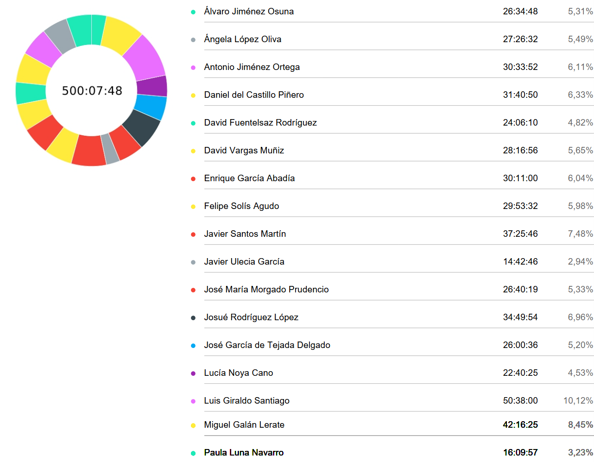

# Revision

**Fecha:** 13/03/2025  
**Grupo 8:** Infantem  
**Sprint 1**

## Integrantes del Grupo

  

    <ul style="padding-left: 0; list-style: none;">
      <li>Álvaro Jiménez Osuna</li>
      <li>Ángela López Oliva</li>
      <li>Antonio Jiménez Ortega</li>
      <li>Daniel del Castillo Piñero</li>
      <li>David Fuentelsaz Rodríguez</li>
      <li>David Vargas Muñiz</li>
      <li>Enrique García Abadía</li>
      <li>Felipe Solís Agudo</li>
      <li>Javier Santos Martín</li>
    </ul>
  

  

    <ul style="padding-left: 0; list-style: none;">
    <li>Javier Ulecia García</li>
      <li>José García de Tejada Delgado</li>
      <li>Jose Maria Morgado Prudencio</li>
      <li>Josué Rodríguez López López</li>
      <li>Lucía Noya Cano</li>
      <li>Luis Giraldo Santiago</li>
      <li>Miguel Galán Lerate</li>
      <li>Paula Luna Navarro</li>
    </ul>
  

## Colaboradores del documento
- Josué Rodríguez López
  - Creó la versión inicial del documento
- José García de Tejada Delgado
  - Formatting colaboradores
---

## Índice
- [Resumen del tiempo invertido por el equipo](#resumen-del-tiempo-invertido-por-el-equipo)
- [Informe detallado de las horas invertidas por cada miembro del equipo](#informe-detallado-de-las-horas-invertidas-por-cada-miembro-del-equipo)
  - [Álvaro Jiménez Osuna](#álvaro-jiménez-osuna)
  - [Ángela López Oliva](#ángela-lópez-oliva)
  - [Antonio Jiménez Ortega](#antonio-jiménez-ortega)
  - [Daniel del Castillo Piñero](#daniel-del-castillo-piñero)
  - [David Fuentelsaz Rodríguez](#david-fuentelsaz-rodríguez)
  - [David Vargas Muñiz](#david-vargas-muñiz)
  - [Enrique García Abadía](#enrique-garcía-abadía)
  - [Felipe Solís Agudo](#felipe-solís-agudo)
  - [Javier Santos Martín](#javier-santos-martín)
  - [Javier Ulecia García](#javier-ulecia-garcía)
  - [Jose Maria Morgado Prudencio](#jose-maria-morgado-prudencio)
  - [Josué Rodríguez López López](#josué-rodríguez-lópez-lópez)
  - [José García de Tejada Delgado](#josé-garcía-de-tejada-delgado)
  - [Lucía Noya Cano](#lucía-noya-cano)
  - [Luis Giraldo Santiago](#luis-giraldo-santiago)
  - [Miguel Galán Lerate](#miguel-galán-lerate)
  - [Paula Luna Navarro](#paula-luna-navarro)

## Resumen del tiempo invertido por el equipo

## Informe detallado de las horas invertidas por cada miembro del equipo

#### Álvaro Jiménez Osuna
| Usuario                       | Tarea                           | Descripción                                                                                | Duración (h) |
|-------------------------------|---------------------------------|--------------------------------------------------------------------------------------------|--------------|
| Álvaro Jiménez Osuna                     | reuniones                       | Reunion Vocales                                                                            |     00:45:02 |
| Álvaro Jiménez Osuna                     | Presentación                    | Presentación                                                                               |     01:28:04 |
| Álvaro Jiménez Osuna                     | Presentación                    | Presentación                                                                               |     01:13:27 |
| Álvaro Jiménez Osuna                     | Presentación                    | Revisión Presentación                                                                      |     00:44:44 |
| Álvaro Jiménez Osuna                     | Documentacion                   | Firmar CA                                                                                  |     00:03:41 |
| Álvaro Jiménez Osuna                     | Presentación                    | Presentación                                                                               |     01:10:31 |
| Álvaro Jiménez Osuna                     | Presentación                    | Revisión Presentación                                                                      |     00:32:44 |
| Álvaro Jiménez Osuna                     | Asistencia a clase              | Clase 07/03                                                                                |     04:00:00 |
| Álvaro Jiménez Osuna                     | Documentacion                   | Imagenes branding grupos                                                                   |     00:09:40 |
| Álvaro Jiménez Osuna                     | Asignación de tareas            | Organización y Subdivisión tareas   Frontend                                               |     00:22:47 |
| Álvaro Jiménez Osuna                     | Presentación                    | Presentación                                                                               |     00:31:00 |
| Álvaro Jiménez Osuna                     | Presentación                    | Preparar la reunión sobre la   presentación                                                |     00:08:00 |
| Álvaro Jiménez Osuna                     | Documentacion                   | Documentación relativa a la IA                                                             |     00:06:13 |
| Álvaro Jiménez Osuna                     | Revisiones de Documentación     | Revisión Diagrama de Clases #87                                                            |     00:36:17 |
| Álvaro Jiménez Osuna                     | Revisiones de Documentación     | Corrección de los documentos para   mantener la coherencia                                 |     01:43:10 |
| Álvaro Jiménez Osuna                     | Revisiones de Documentación     | Revisión Diagrama de Clases #87                                                            |     00:05:37 |
| Álvaro Jiménez Osuna                     | reuniones                       | Organización de Equipo de trabajo   como Vocal                                             |     00:13:50 |
| Álvaro Jiménez Osuna                     | reuniones                       | Reunión Vocales                                                                            |     00:51:45 |
| Álvaro Jiménez Osuna                     | Código                          | Login Screen                                                                               |     00:58:23 |
| Álvaro Jiménez Osuna                     | Asignación de tareas            | Revisión política de ramas                                                                 |     00:08:59 |
| Álvaro Jiménez Osuna                     | Código                          | Customize icons                                                                            |     00:56:09 |
| Álvaro Jiménez Osuna                     | Código                          | Login Profile                                                                              |     00:52:09 |
| Álvaro Jiménez Osuna                     | Código                          | Login profile banco de avatares                                                            |     01:54:50 |
| Álvaro Jiménez Osuna                     | reuniones                       | Reunión                                                                                    |     00:43:35 |
| Álvaro Jiménez Osuna                     | Código                          | Login profile banco de avatares                                                            |     00:22:08 |
| Álvaro Jiménez Osuna                     | Presentación                    | Revisión y unificación estilos   Presentacion                                              |     01:56:13 |
| Álvaro Jiménez Osuna                     | Asignación de tareas            | Set Up proyecto Mac                                                                        |     01:43:02 |
| Álvaro Jiménez Osuna                     | Documentacion                   | MsProject y Presentación                                                                   |     02:12:48 |

#### Ángela López Oliva
| Usuario                       | Tarea                           | Descripción                                                                                | Duración (h) |
|-------------------------------|---------------------------------|--------------------------------------------------------------------------------------------|--------------|
| Ángela López Oliva            | Presentación                    | Presentación                                                                               |     00:35:41 |
| Ángela López Oliva            | Código                          | Home-Page-Style                                                                            |     00:18:00 |
| Ángela López Oliva            | Presentación                    | Presentación                                                                               |     02:38:16 |
| Ángela López Oliva            | Código                          | Home-Page-Style                                                                            |     01:31:39 |
| Ángela López Oliva            | Presentación                    | Presentación                                                                               |     01:49:14 |
| Ángela López Oliva            | Presentación                    | Presentación                                                                               |     03:17:49 |
| Ángela López Oliva            | Asistencia a clase              | Clase                                                                                      |     04:00:00 |
| Ángela López Oliva            | reuniones                       | Revision Presentacion                                                                      |     00:44:39 |
| Ángela López Oliva            | Documentacion                   | C.A Usuarios Piloto                                                                        |     00:27:17 |
| Ángela López Oliva            | Asistencia a clase              | Clase                                                                                      |     04:00:00 |
| Ángela López Oliva            | Github Project                  | Instanciar y arrancar Proyecto                                                             |     00:46:25 |
| Ángela López Oliva            | Presentación                    | Presentación                                                                               |     01:07:17 |
| Ángela López Oliva            | Código                          | Log-in                                                                                     |     00:54:42 |
| Ángela López Oliva            | Presentación                    | Presentación                                                                               |     00:49:50 |
| Ángela López Oliva            | Presentación                    | Presentación                                                                               |     01:12:44 |
| Ángela López Oliva            | Presentación                    | Presentación y Ms Project                                                                  |     03:12:59 |

#### Antonio Jiménez Ortega
| Usuario                       | Tarea                           | Descripción                                                                                | Duración (h) |
|-------------------------------|---------------------------------|--------------------------------------------------------------------------------------------|--------------|
| Antonio Jiménez Ortega        | Código                          | Traducir de ingles a castellano la   app + datos                                           |     01:39:05 |
| Antonio Jiménez Ortega        | Código                          | Mostrar recetas favoritas de usuario                                                       |     03:27:03 |
| Antonio Jiménez Ortega        | Documentacion                   | Pasar a MD docs de Análisis                                                                |     00:24:00 |
| Antonio Jiménez Ortega        | Código                          | Mostrar recetas favoritas de usuario                                                       |     00:28:35 |
| Antonio Jiménez Ortega        | Código                          | Mostrar recetas favoritas de usuario                                                       |     03:02:41 |
| Antonio Jiménez Ortega        | Documentacion                   | Pasar a MD docs                                                                            |     01:19:43 |
| Antonio Jiménez Ortega        | reuniones                       | Reunión por discord                                                                        |     01:11:00 |
| Antonio Jiménez Ortega        |                                 | Revisión análisis de los riesgos                                                           |     01:05:20 |
| Antonio Jiménez Ortega        | Código                          | Clonado e instalación del proyecto                                                         |     00:12:03 |
| Antonio Jiménez Ortega        | Asignación de tareas            | Organización de trabajo frontend                                                           |     00:33:37 |
| Antonio Jiménez Ortega        | Asignación de tareas            | Organización de trabajo frontend                                                           |     00:15:08 |
| Antonio Jiménez Ortega        | Revisiones de Documentación     | Revisión S1                                                                                |     03:31:00 |
| Antonio Jiménez Ortega        | Documentacion                   | Pasar a MD docs                                                                            |     03:09:07 |
| Antonio Jiménez Ortega        | Documentacion                   | Pasar a MD docs                                                                            |     00:13:18 |
| Antonio Jiménez Ortega        | Documentacion                   | Pasar a MD docs de Análisis                                                                |     02:23:44 |
| Antonio Jiménez Ortega        | Documentacion                   | Pasar a MD docs de Análisis                                                                |     01:09:22 |
| Antonio Jiménez Ortega        | Usuario piloto de grupo externo | Usuario piloto                                                                             |     00:03:25 |
| Antonio Jiménez Ortega        | Usuario piloto de grupo externo | Usuario piloto                                                                             |     00:10:09 |
| Antonio Jiménez Ortega        | Documentacion                   | Pasar a MD docs de Análisis                                                                |     02:25:46 |
| Antonio Jiménez Ortega        | Documentacion                   | Pasar a MD docs de Análisis                                                                |     01:09:45 |
| Antonio Jiménez Ortega        | Documentacion                   | Grabar video demo app                                                                      |     02:40:01 |

#### Daniel del Castillo Piñero
| Usuario                       | Tarea                           | Descripción                                                                                | Duración (h) |
|-------------------------------|---------------------------------|--------------------------------------------------------------------------------------------|--------------|
| Daniel del Castillo Piñero                     | Código                          | Arreglo base de datos                                                                      |     01:27:58 |
| Daniel del Castillo Piñero                     | Código                          | Recipe suggestions                                                                         |     00:24:32 |
| Daniel del Castillo Piñero                     | Código                          | Recipe suggestions                                                                         |     01:53:33 |
| Daniel del Castillo Piñero                     | Documentacion                   | Firma CA                                                                                   |     00:04:01 |
| Daniel del Castillo Piñero                     | Presentación                    | Revisión de la presentación                                                                |     00:43:08 |
| Daniel del Castillo Piñero                     | Asistencia a clase              | Clase 07/03                                                                                |     04:00:00 |
| Daniel del Castillo Piñero                     | Database                        | Populando base de datos                                                                    |     02:07:09 |
| Daniel del Castillo Piñero                     | Código                          | Instanciar el proyecto                                                                     |     00:47:46 |
| Daniel del Castillo Piñero                     | Usuarios Piloto                 | Contacto con los usuarios piloto                                                           |     00:17:47 |
| Daniel del Castillo Piñero                     | Asistencia a clase              | Clase 21/2                                                                                 |     04:00:00 |
| Daniel del Castillo Piñero                     | reuniones                       | reunion 22/02                                                                              |     01:29:25 |
| Daniel del Castillo Piñero                     | Asignación de tareas            | Asignación de tareas                                                                       |     01:44:26 |
| Daniel del Castillo Piñero                     | reuniones                       | Creación documento PROMPTS                                                                 |     00:10:00 |
| Daniel del Castillo Piñero                     | Requisitos                      | Lectura y revisión de requisitos de   información                                          |     00:15:09 |
| Daniel del Castillo Piñero                     | reuniones                       | Reunión de vocales 01/03                                                                   |     00:51:56 |
| Daniel del Castillo Piñero                     | Revisión de pull requests       | Revisión de las pull request                                                               |     00:13:41 |
| Daniel del Castillo Piñero                     | reuniones                       | Reunión de vocales 05/03                                                                   |     00:48:30 |
| Daniel del Castillo Piñero                     | Documentacion                   | Informe de productividad del equipo                                                        |     01:32:53 |
| Daniel del Castillo Piñero                     | reuniones                       | Preparación para la reunión de   vocales                                                   |     01:07:34 |
| Daniel del Castillo Piñero                     | reuniones                       | Reunión de vocales 08/03                                                                   |     00:52:52 |
| Daniel del Castillo Piñero                     | reuniones                       | reunion vocales 10/03                                                                      |     00:53:18 |
| Daniel del Castillo Piñero                     | Código                          | Recipe suggestions                                                                         |     00:57:21 |
| Daniel del Castillo Piñero                     | reuniones                       | Reunión vocales 12/03                                                                      |     00:38:42 |
| Daniel del Castillo Piñero                     | Código                          | Profile                                                                                    |     04:19:09 |

#### David Fuentelsaz Rodríguez
| Usuario                       | Tarea                           | Descripción                                                                                | Duración (h) |
|-------------------------------|---------------------------------|--------------------------------------------------------------------------------------------|--------------|
| David Fuentelsaz Rodríguez    | Diagramas de clase              | UML                                                                                        |     00:36:56 |
| David Fuentelsaz Rodríguez    | reuniones                       | Reunión 05/03                                                                              |     00:40:18 |
| David Fuentelsaz Rodríguez    | Código                          | Corregir lógica baby                                                                       |     01:37:37 |
| David Fuentelsaz Rodríguez    | Código                          | Corregir lógica baby                                                                       |     01:46:48 |
| David Fuentelsaz Rodríguez    | Código                          | Corregir lógica baby                                                                       |     00:05:15 |
| David Fuentelsaz Rodríguez    | Documentacion                   | Permorfmance Evaluation                                                                    |     00:15:13 |
| David Fuentelsaz Rodríguez    | Código                          | Resolucion de errores login                                                                |     01:30:00 |
| David Fuentelsaz Rodríguez    | Código                          | Revisión login backend                                                                     |     00:37:00 |
| David Fuentelsaz Rodríguez    | Asistencia a clase              | Clase 07/03                                                                                |     04:00:00 |
| David Fuentelsaz Rodríguez    | Código                          | Resolución conflictos login                                                                |     00:50:00 |
| David Fuentelsaz Rodríguez    | reuniones                       | Reunión vocales 08/03                                                                      |     00:35:26 |
| David Fuentelsaz Rodríguez    | reuniones                       | Reunión backend                                                                            |     00:28:05 |
| David Fuentelsaz Rodríguez    | Documentacion                   | CA markdown                                                                                |     01:13:25 |
| David Fuentelsaz Rodríguez    | Diagramas de clase              | UML                                                                                        |     00:08:38 |
| David Fuentelsaz Rodríguez    | Diagramas de clase              | UML                                                                                        |     00:42:04 |
| David Fuentelsaz Rodríguez    |                                 | Clase 21/02                                                                                |     03:59:35 |
| David Fuentelsaz Rodríguez    | Requisitos                      | Requisitos de información                                                                  |     01:40:58 |
| David Fuentelsaz Rodríguez    | Diagramas de clase              | UML                                                                                        |     00:15:51 |
| David Fuentelsaz Rodríguez    | Diagramas de clase              | UML                                                                                        |     01:00:04 |
| David Fuentelsaz Rodríguez    | Diagramas de clase              | UML                                                                                        |     00:17:34 |
| David Fuentelsaz Rodríguez    | Diagramas de clase              | UML                                                                                        |     00:34:39 |
| David Fuentelsaz Rodríguez    | Visualizacion de videos de EV   | Visualización vídeos EV                                                                    |     01:10:44 |

#### David Vargas Muñiz
| Usuario                       | Tarea                           | Descripción                                                                                | Duración (h) |
|-------------------------------|---------------------------------|--------------------------------------------------------------------------------------------|--------------|
| David Vargas Muñiz                     | Presentación                    | Preparar presentación 07/03/2025                                                           |     00:51:00 |
| David Vargas Muñiz                     | Código                          | Estudio del frontend de la app para   la realización de pruebas                            |     00:42:45 |
| David Vargas Muñiz                     | Asistencia a clase              | Clase 21/02/2025.                                                                          |     04:00:00 |
| David Vargas Muñiz                     | reuniones                       | Reunión 22/02/2025                                                                         |     01:34:08 |
| David Vargas Muñiz                     |                                 | Setup proyecto.                                                                            |     00:48:12 |
| David Vargas Muñiz                     | Presentación                    | Preparar presentación 07/03/2025                                                           |     00:37:40 |
| David Vargas Muñiz                     | Presentación                    | Preparar presentación 07/03/2025                                                           |     01:02:46 |
| David Vargas Muñiz                     | Presentación                    | Preparar presentación 07/03/2025                                                           |     01:25:20 |
| David Vargas Muñiz                     | Presentación                    | Preparar presentación 07/03/2025                                                           |     01:41:28 |
| David Vargas Muñiz                     | Asistencia a clase              | Clase 07/03/2025                                                                           |     04:00:00 |
| David Vargas Muñiz                     | Presentación                    | Preparar presentación 14/03/2025                                                           |     00:24:44 |
| David Vargas Muñiz                     | Presentación                    | Preparar presentación 14/03/2025                                                           |     01:02:40 |
| David Vargas Muñiz                     | Visualizacion de videos de EV   | ISPP - Session 05b (46:42)                                                                 |     00:07:33 |
| David Vargas Muñiz                     | Visualizacion de videos de EV   | ISPP - Session 05b (46:42)                                                                 |     00:21:49 |
| David Vargas Muñiz                     | Visualizacion de videos de EV   | ISPP - Session 05a (26:38)                                                                 |     00:27:30 |
| David Vargas Muñiz                     | Presentación                    | Preparar presentación 14/03/2025                                                           |     01:15:02 |
| David Vargas Muñiz                     | Visualizacion de videos de EV   | ISPP - Session 05b (46:42)                                                                 |     00:25:54 |
| David Vargas Muñiz                     | Presentación                    | Preparar presentación 14/03/2025                                                           |     01:32:29 |
| David Vargas Muñiz                     | Presentación                    | Preparar presentación 14/03/2025                                                           |     02:12:05 |
| David Vargas Muñiz                     | Presentación                    | Preparar presentación 14/03/2025                                                           |     00:15:17 |
| David Vargas Muñiz                     | Presentación                    | Preparar presentación 14/03/2025                                                           |     03:28:34 |

#### Enrique García Abadía
| Usuario                       | Tarea                           | Descripción                                                                                | Duración (h) |
|-------------------------------|---------------------------------|--------------------------------------------------------------------------------------------|--------------|
| Enrique García Abadía         | Código                          | Frontend Baby, pestaña edit y add                                                          |     03:10:00 |
| Enrique García Abadía         | Código                          | Modificación pestaña de bebes con   implementación de backend                              |     01:39:00 |
| Enrique García Abadía         | Código                          | Conexión con backend de pestaña de   bebes                                                 |     03:17:00 |
| Enrique García Abadía         | Asistencia a clase              | Clase día 07/03                                                                            |     04:00:00 |
| Enrique García Abadía         | reuniones                       | Reunión vocales día 05/03                                                                  |     00:48:00 |
| Enrique García Abadía         | Código                          | Estructura base frontend registro de   alimentos y navbar                                  |     01:35:00 |
| Enrique García Abadía         | Asistencia a clase              | Clase día 21/02                                                                            |     04:00:00 |
| Enrique García Abadía         | reuniones                       | Reunión día 22/02                                                                          |     01:32:00 |
| Enrique García Abadía         | reuniones                       | Reunión coordinadores día 01/03                                                            |     00:21:00 |
| Enrique García Abadía         | Código                          | Modificaciones de la pestaña de   registro de alimentos                                    |     01:11:00 |
| Enrique García Abadía         | Revisión Frontend               | Revisión y unificación de   estilos  de frontend pre-presentación                          |     02:22:00 |
| Enrique García Abadía         | reuniones                       | Reunión vocales día 08/03                                                                  |     00:36:00 |
| Enrique García Abadía         | reuniones                       | Reunión vocales día 10/03                                                                  |     00:57:00 |
| Enrique García Abadía         | Código                          | Creación pestaña de bebes                                                                  |     00:58:00 |
| Enrique García Abadía         | reuniones                       | Reunión vocales día 12/03                                                                  |     00:41:00 |
| Enrique García Abadía         | Revisión Sprint                 | Revisión final de aplicación                                                               |     03:04:00 |

#### Felipe Solís Agudo
| Usuario                       | Tarea                           | Descripción                                                                                | Duración (h) |
|-------------------------------|---------------------------------|--------------------------------------------------------------------------------------------|--------------|
| Felipe Solís Agudo            | Visualizacion de videos de EV   | ISPP - Session 05a (26:38)                                                                 |     00:27:00 |
| Felipe Solís Agudo            | Visualizacion de videos de EV   | ISPP - Session 05b (46:42)                                                                 |     00:47:00 |
| Felipe Solís Agudo            | Documentacion                   | Costes y beneficios a 6 meses/1 año   del lanzamiento del proyecto                         |     00:35:57 |
| Felipe Solís Agudo            | Documentacion                   | Costes y beneficios 1era semana en   producción semana 16 del proyecto                     |     00:20:06 |
| Felipe Solís Agudo            | reuniones                       | Reunión vocales 12/03/2025                                                                 |     00:42:13 |
| Felipe Solís Agudo            | reuniones                       | Reunión vocales 10/03/2025                                                                 |     00:52:14 |
| Felipe Solís Agudo            | Github Project                  | Asignación tareas frontend y revisión   pull request                                       |     00:25:39 |
| Felipe Solís Agudo            | reuniones                       | Reunión vocales 08/03/2025                                                                 |     00:33:21 |
| Felipe Solís Agudo            | Código                          | Actualizaciones Navbar,   recipeRecommendations vista y nueva vista recipeDetails          |     00:49:59 |
| Felipe Solís Agudo            | Código                          | Actualización Navbar, globalStyles y   modificacion vista recipeRecommendations            |     00:06:00 |
| Felipe Solís Agudo            |                                 | Primer prototipo   recipe-recommendations page y lectura procedimientos                    |     00:07:45 |
| Felipe Solís Agudo            | Revisiones de Documentación     | Revisión diagrama de clases                                                                |     00:30:42 |
| Felipe Solís Agudo            | Documentacion                   | Actualización Requisitos Funcionales   al nuevo MVP                                        |     00:35:20 |
| Felipe Solís Agudo            |                                 | Instalación repositorio                                                                    |     00:26:22 |
| Felipe Solís Agudo            | Asistencia a clase              | Clase 21/02/2025                                                                           |     04:00:00 |
| Felipe Solís Agudo            | reuniones                       | Reunión 22/02/2025                                                                         |     01:33:49 |
| Felipe Solís Agudo            |                                 | Acta reunión 22/02/2025 y   modificación nombre Clockify                                   |     00:24:31 |
| Felipe Solís Agudo            |                                 | Instalación repositorio                                                                    |     00:12:53 |
| Felipe Solís Agudo            |                                 | Instalación repositorio                                                                    |     00:14:53 |
| Felipe Solís Agudo            | Revisiones de Documentación     | Firma CommitmentAgreement y lectura   acta reunión 01/03/2025                              |     00:11:30 |
| Felipe Solís Agudo            | Documentacion                   | Introducción Prompts a documento de   Prompts                                              |     00:02:36 |
| Felipe Solís Agudo            | Código                          | NavBar y comienzo frontend   recipe-recommendations                                        |     00:45:04 |
| Felipe Solís Agudo            |                                 | Primer prototipo   recipe-recommendations page y lectura procedimientos                    |     00:30:43 |
| Felipe Solís Agudo            | Código                          | Actualización Navbar, globalStyles y   modificacion vista recipeRecommendations            |     01:20:49 |
| Felipe Solís Agudo            | Código                          | Actualizaciones Navbar,   recipeRecommendations vista y nueva vista recipeDetails          |     00:36:33 |
| Felipe Solís Agudo            | reuniones                       | Reunión 05/03/2024 + Acta reunión                                                          |     00:48:14 |
| Felipe Solís Agudo            | Usuarios Piloto                 | Encuesta usuario piloto EventBride                                                         |     00:23:06 |
| Felipe Solís Agudo            | Asistencia a clase              | Clases 07/03/2025                                                                          |     04:00:00 |
| Felipe Solís Agudo            | reuniones                       | Acta reunión 08/03/2025                                                                    |     00:03:49 |
| Felipe Solís Agudo            | Código                          | Ajuste frontend-backend   recipeRecommendations y recipeDetails                            |     01:13:19 |
| Felipe Solís Agudo            | Código                          | Actualización recipeRecommendations,   recipeDetails y creación vista favoriteRecipes      |     01:24:43 |
| Felipe Solís Agudo            | Usuarios Piloto                 | Commitment Agreement usuario piloto   grupo 3                                              |     00:02:45 |
| Felipe Solís Agudo            | Código                          | Intento solución error recetas                                                             |     00:34:31 |
| Felipe Solís Agudo            | Documentacion                   | Costes Personales Sprint2                                                                  |     00:47:26 |
| Felipe Solís Agudo            | Documentacion                   | Costes y beneficios 1era semana en   producción semana 16 del proyecto                     |     00:53:05 |
| Felipe Solís Agudo            | Documentacion                   | Firma commitment agreement y rellenar   tabla rendimiento sprint1                          |     00:12:01 |
| Felipe Solís Agudo            | Revisiones de Documentación     | Revisión todos los documentos   obligatorios S1                                            |     01:46:16 |
| Felipe Solís Agudo            | Documentacion                   | Resolviendo error costes                                                                   |     00:31:18 |

#### Javier Santos Martín
| Usuario                       | Tarea                           | Descripción                                                                                | Duración (h) |
|-------------------------------|---------------------------------|--------------------------------------------------------------------------------------------|--------------|
| Javier Santos Martín                  | Código                          | Arreglando bugs                                                                            |     01:22:09 |
| Javier Santos Martín                  | Código                          | Arreglando baby                                                                            |     04:00:34 |
| Javier Santos Martín                  | Código                          | Manejo de sesión en cliente                                                                |     01:47:05 |
| Javier Santos Martín                  | Código                          | Login + Signup en el cliente                                                               |     01:47:52 |
| Javier Santos Martín                  | Código                          | Añadir opción de registrarse                                                               |     01:05:29 |
| Javier Santos Martín                  | reuniones                       | Reunion vocales Mar 12                                                                     |     00:39:10 |
| Javier Santos Martín                  | Código                          | arreglar cors para peticiones con   auth desde el cliente al servidor                      |     01:54:42 |
| Javier Santos Martín                  | Código                          | Refactorización de la Navbar                                                               |     03:12:15 |
| Javier Santos Martín                  | Código                          | Moviendo datos hardcodeados en   frontend a ficheros separados                             |     00:15:41 |
| Javier Santos Martín                  | reuniones                       | Reunion vocales Mar 5                                                                      |     00:50:17 |
| Javier Santos Martín                  | reuniones                       | Reunión vocales Mar 1                                                                      |     00:44:13 |
| Javier Santos Martín                  | reuniones                       | Reunión Feb 22                                                                             |     01:20:12 |
| Javier Santos Martín                  | Documentación CI/CD             | Documentar la CI                                                                           |     00:45:16 |
| Javier Santos Martín                  | Código                          | Issue #39 \| Estilo de la aplicación                                                       |     01:29:24 |
| Javier Santos Martín                  | Código                          | Issue #63 \| Desarrollo del frontend                                                       |     01:20:36 |
| Javier Santos Martín                  | Código                          | Issue #63 \| Desarrollo del frontend                                                       |     01:14:00 |
| Javier Santos Martín                  | Documentación CI/CD             | Issue #28 \| CI/CD                                                                         |     00:12:43 |
| Javier Santos Martín                  | Código                          | Arreglando estilo de la screen de   alergenos                                              |     00:26:04 |
| Javier Santos Martín                  | Código                          | Moviendo datos hardcodeados en   frontend a ficheros separados                             |     00:21:05 |
| Javier Santos Martín                  | Documentacion                   | Firmar commitment agreement                                                                |     00:08:12 |
| Javier Santos Martín                  | Asistencia a clase              | Clase Mar 07                                                                               |     04:00:00 |
| Javier Santos Martín                  | Revisiones de Documentación     | Revision acta + actualizacion de CA                                                        |     00:11:48 |
| Javier Santos Martín                  | reuniones                       | Reunion vocales Mar 10                                                                     |     00:38:05 |
| Javier Santos Martín                  | Código                          | Refactorización de la navegacion                                                           |     00:39:32 |
| Javier Santos Martín                  | Asistencia a clase              | Clase 21/02                                                                                |     04:00:00 |
| Javier Santos Martín                  | Revisión Sprint                 | Arreglar fallos del final y cambios   en la landing page                                   |     02:59:22 |

#### Javier Ulecia García
| Usuario                       | Tarea                           | Descripción                                                                                | Duración (h) |
|-------------------------------|---------------------------------|--------------------------------------------------------------------------------------------|--------------|
| Javier Ulecia García          | Asistencia a clase              | Clase 07/03/25                                                                             |     04:00:00 |
| Javier Ulecia García          | Documentacion                   | Documento de equipo                                                                        |     00:34:37 |
| Javier Ulecia García          | Código                          | Entidad Bebe y CRUD                                                                        |     00:59:41 |
| Javier Ulecia García          | reuniones                       | reunion 22/02                                                                              |     01:25:33 |
| Javier Ulecia García          |                                 | clase 21/02                                                                                |     04:00:09 |
| Javier Ulecia García          | Documentacion                   | MVP                                                                                        |     00:45:07 |
| Javier Ulecia García          | Código                          | login                                                                                      |     00:35:31 |
| Javier Ulecia García          | Código                          | Entidad Bebe y CRUD                                                                        |     00:18:56 |
| Javier Ulecia García          | Código                          | correccion login                                                                           |     00:17:59 |
| Javier Ulecia García          | Código                          | registro alimentos                                                                         |     00:42:05 |
| Javier Ulecia García          | Código                          | registro alimentos                                                                         |     00:22:24 |
| Javier Ulecia García          | Código                          | registro alimentos                                                                         |     00:03:59 |
| Javier Ulecia García          | Código                          | Validacion ususario                                                                        |     00:36:45 |

#### José María Morgado Prudencio
| Usuario                       | Tarea                           | Descripción                                                                                | Duración (h) |
|-------------------------------|---------------------------------|--------------------------------------------------------------------------------------------|--------------|
| José María Morgado Prudencio                  | Documentacion                   | Pasar UsuarioPiloto a md                                                                   |     00:11:40 |
| José María Morgado Prudencio                  | Código                          | Implementacion de clases                                                                   |     01:09:30 |
| José María Morgado Prudencio                  | Documentacion                   | Analisis de Riesgos                                                                        |     01:17:14 |
| José María Morgado Prudencio                  | Código                          | Implementacion de clases                                                                   |     03:03:36 |
| José María Morgado Prudencio                  | Código                          | Implementacion de clases                                                                   |     00:43:41 |
| José María Morgado Prudencio                  | Documentacion                   | Investigación sobre la implementación   de la publicidad en la app                         |     02:14:00 |
| José María Morgado Prudencio                  | Visualizacion de videos de EV   | Visualizacion de pildoras teoricas                                                         |     00:25:00 |
| José María Morgado Prudencio                  | Código                          | Setup del proyecto                                                                         |     00:53:57 |
| José María Morgado Prudencio                  |                                 | Añadir disponibilidad                                                                      |     00:10:00 |
| José María Morgado Prudencio                  |                                 | Gestion de las tareas a realizar e   incluir plantilla de analisis de riesgos              |     00:45:00 |
| José María Morgado Prudencio                  | Visualizacion de videos de EV   | Visualizacion de pildoras teoricas                                                         |     00:27:06 |
| José María Morgado Prudencio                  | Visualizacion de videos de EV   | Visualizacion de pildoras teoricas                                                         |     01:10:00 |
| José María Morgado Prudencio                  | Documentacion                   | Corrección de la tarea realizada y   implementacion de clases (no terminado)               |     02:40:02 |
| José María Morgado Prudencio                  | Código                          | Implementacion de clases                                                                   |     01:00:00 |
| José María Morgado Prudencio                  | Código                          | Implementacion de clases                                                                   |     01:33:28 |
| José María Morgado Prudencio                  | Código                          | Correccion de las clases                                                                   |     01:04:06 |
| José María Morgado Prudencio                  | Asistencia a clase              | Asistencia a clase                                                                         |     04:00:00 |
| José María Morgado Prudencio                  | Código                          | Renombrar carpetas proyecto                                                                |     01:11:11 |
| José María Morgado Prudencio                  | Código                          | Filtro de recetas                                                                          |     02:04:08 |
| José María Morgado Prudencio                  | Usuarios Piloto                 | Usuarios Piloto Gestion de Respuestas                                                      |     00:36:40 |

#### Josué Rodríguez López
| Usuario                       | Tarea                           | Descripción                                                                                | Duración (h) |
|-------------------------------|---------------------------------|--------------------------------------------------------------------------------------------|--------------|
| Josué Rodríguez López               | Documentacion                   | Firmar CA de nuevo                                                                         |     00:07:55 |
| Josué Rodríguez López               | Código                          | Fix token para poder ser utilizado   desde frontend                                        |     01:20:00 |
| Josué Rodríguez López               | Código                          | Implementar Recetas                                                                        |     01:10:29 |
| Josué Rodríguez López               | Usuario piloto de grupo externo | Rellenar CA del G4                                                                         |     00:17:39 |
| Josué Rodríguez López               | Código                          | Implementar Recetas                                                                        |     01:23:06 |
| Josué Rodríguez López               | Código                          | Login / Register                                                                           |     01:26:25 |
| Josué Rodríguez López               | reuniones                       | Reunión                                                                                    |     00:29:42 |
| Josué Rodríguez López               | Usuario piloto de grupo externo | Responder encuesta                                                                         |     00:27:47 |
| Josué Rodríguez López               | Documentacion                   | Reporte de tiempo-esfuerzo                                                                 |     02:54:02 |
| Josué Rodríguez López               | Documentacion                   | PerformanceEvaluation                                                                      |     00:19:05 |
| Josué Rodríguez López               | Código                          | Resolución de problemas en la lógica   de recipes y baby                                   |     01:38:00 |
| Josué Rodríguez López               | Código                          | Resolución de problemas en la lógica   de recipes y baby                                   |     00:20:26 |
| Josué Rodríguez López               | Código                          | Investigar panel de administrador                                                          |     00:07:58 |
| Josué Rodríguez López               | Diagramas de clase              | UML                                                                                        |     00:19:56 |
| Josué Rodríguez López               | Diagramas de clase              | UML                                                                                        |     00:06:19 |
| Josué Rodríguez López               | Testing                         | Testing alergenos                                                                          |     00:59:28 |
| Josué Rodríguez López               | Código                          | Setup project                                                                              |     00:37:23 |
| Josué Rodríguez López               | Control de clockify             | Control de entradas de tiempo en   clockify                                                |     00:21:41 |
| Josué Rodríguez López               | Asistencia a clase              | Asistencia a clase                                                                         |     04:00:00 |
| Josué Rodríguez López               | Diagramas de clase              | UML                                                                                        |     00:04:11 |
| Josué Rodríguez López               | Diagramas de clase              | UML                                                                                        |     01:17:57 |
| Josué Rodríguez López               | Requisitos                      | Requisitos de información                                                                  |     01:27:03 |
| Josué Rodríguez López               | Asistencia a clase              | Asistencia a clase                                                                         |     04:00:00 |
| Josué Rodríguez López               | reuniones                       | Reunión                                                                                    |     01:32:10 |
| Josué Rodríguez López               | Requisitos                      | Requisitos de información                                                                  |     00:12:30 |
| Josué Rodríguez López               | reuniones                       | Reunión                                                                                    |     00:48:27 |
| Josué Rodríguez López               | reuniones                       | Reunión                                                                                    |     00:48:11 |
| Josué Rodríguez López               | reuniones                       | Reunión                                                                                    |     00:36:14 |
| Josué Rodríguez López               | Asignación de tareas            | Revisión de tareas en backend                                                              |     00:04:15 |
| Josué Rodríguez López               | Testing                         | Testing alergenos                                                                          |     01:24:25 |
| Josué Rodríguez López               | Código                          | Gestión de normativas en backend                                                           |     00:19:25 |
| Josué Rodríguez López               | reuniones                       | Reunión de planificación de entrega                                                        |     00:54:56 |
| Josué Rodríguez López               | Código                          | Implementar Recetas                                                                        |     02:46:16 |
| Josué Rodríguez López               | Control de clockify             | Control de usuarios                                                                        |     00:06:33 |

#### José García de Tejada Delgado
| Usuario                       | Tarea                           | Descripción                                                                                | Duración (h) |
|-------------------------------|---------------------------------|--------------------------------------------------------------------------------------------|--------------|
| José García de Tejada Delgado |                                 | testing babies                                                                             |     01:00:00 |
| José García de Tejada Delgado |                                 | login,register                                                                             |     00:04:34 |
| José García de Tejada Delgado |                                 | login,register                                                                             |     00:21:23 |
| José García de Tejada Delgado |                                 | login,register                                                                             |     00:27:20 |
| José García de Tejada Delgado |                                 | theory pills                                                                               |     01:19:24 |
| José García de Tejada Delgado |                                 | login,register                                                                             |     00:15:55 |
| José García de Tejada Delgado |                                 | Algoritmo alérgenos                                                                        |     01:50:00 |
| José García de Tejada Delgado |                                 | clase 7 marzo                                                                              |     00:45:00 |
| José García de Tejada Delgado |                                 | Traducción backend                                                                         |     02:12:28 |
| José García de Tejada Delgado |                                 | Cloning and setting up codebase                                                            |     01:00:25 |
| José García de Tejada Delgado |                                 | reunión 24 febrero + lectura actas                                                         |     01:00:00 |
| José García de Tejada Delgado |                                 | Lectura actas reunión vocales                                                              |     00:26:09 |
| José García de Tejada Delgado |                                 | clase 7 marzo                                                                              |     01:00:00 |
| José García de Tejada Delgado |                                 | reunion backend                                                                            |     00:22:49 |
| José García de Tejada Delgado |                                 | login,register                                                                             |     03:24:01 |
| José García de Tejada Delgado |                                 | login,register                                                                             |     01:02:59 |
| José García de Tejada Delgado |                                 | login,register                                                                             |     00:53:47 |
| José García de Tejada Delgado |                                 | login,register                                                                             |     00:50:03 |
| José García de Tejada Delgado |                                 | reunion                                                                                    |     00:19:58 |
| José García de Tejada Delgado |                                 | fix backend babies                                                                         |     04:05:36 |
| José García de Tejada Delgado |                                 | trabajo                                                                                    |     02:25:50 |
| José García de Tejada Delgado |                                 | docs                                                                                       |     00:52:55 |

#### Lucía Noya Cano
| Usuario                       | Tarea                           | Descripción                                                                                | Duración (h) |
|-------------------------------|---------------------------------|--------------------------------------------------------------------------------------------|--------------|
| Lucía Noya Cano               | Documentación CI/CD             | Commitment Agreement                                                                       |     00:34:51 |
| Lucía Noya Cano               | Código                          | Arrancar e instanciar proyecto                                                             |     00:53:25 |
| Lucía Noya Cano               | reuniones                       | Planificación semanal sprint 1                                                             |     00:11:46 |
| Lucía Noya Cano               | reuniones                       | Planificación semanal sprint 1                                                             |     01:20:28 |
| Lucía Noya Cano               | Código                          | Arrancar e instanciar proyecto                                                             |     01:31:00 |
| Lucía Noya Cano               | Documentación CI/CD             | Commitment Agreement                                                                       |     00:17:58 |
| Lucía Noya Cano               | Documentación CI/CD             | Commitment Agreement                                                                       |     00:12:27 |
| Lucía Noya Cano               | Documentacion                   | PilotUsersPerformanceEvaluation                                                            |     00:37:38 |
| Lucía Noya Cano               | Usuarios Piloto                 | Guía visual para usuarios piloto                                                           |     01:01:00 |
| Lucía Noya Cano               | Documentacion                   | Commitment Agreement Pilot Users                                                           |     01:10:19 |
| Lucía Noya Cano               | reuniones                       | Reunión backend                                                                            |     00:09:45 |
| Lucía Noya Cano               | reuniones                       | Reunión de vocales                                                                         |     00:51:20 |
| Lucía Noya Cano               | reuniones                       | Reunión de vocales                                                                         |     00:09:04 |
| Lucía Noya Cano               | Código                          | Task #52: Recomendaciones recetas                                                          |     00:37:08 |
| Lucía Noya Cano               | Asistencia a clase              | Asistencia a clase                                                                         |     04:00:00 |
| Lucía Noya Cano               | Código                          | Task #92: Enfermedad y Vacunas                                                             |     01:01:13 |
| Lucía Noya Cano               | Código                          | Task #52: Recomendaciones recetas                                                          |     00:53:12 |
| Lucía Noya Cano               | Código                          | Task #37: Create Ingesta Class &   CRUD                                                    |     00:32:31 |
| Lucía Noya Cano               | Código                          | Task #37: Create Ingesta Class &   CRUD                                                    |     01:28:52 |
| Lucía Noya Cano               | Documentacion                   | Sign Commitment Agreement                                                                  |     00:05:39 |
| Lucía Noya Cano               | Código                          | Task #52: Recomendaciones recetas                                                          |     00:52:44 |
| Lucía Noya Cano               | Código                          | Task #52: Recomendaciones recetas                                                          |     00:19:37 |
| Lucía Noya Cano               | Código                          | Task #52: Recomendaciones recetas                                                          |     00:33:00 |
| Lucía Noya Cano               | reuniones                       | Reunión backend                                                                            |     00:10:07 |
| Lucía Noya Cano               | Documentacion                   | AI Usage markdown                                                                          |     00:28:00 |
| Lucía Noya Cano               | Usuarios Piloto                 | Pilot Users Form                                                                           |     00:34:47 |
| Lucía Noya Cano               | Código                          | AuthService test                                                                           |     00:52:00 |
| Lucía Noya Cano               | Documentacion                   | Sign new CA                                                                                |     00:14:33 |
| Lucía Noya Cano               | Código                          | AuthService test                                                                           |     00:11:27 |
| Lucía Noya Cano               | Documentacion                   | Complete Performance Evaluation                                                            |     00:23:37 |
| Lucía Noya Cano               | Documentacion                   | Update docs authoring                                                                      |     00:20:57 |

#### Luis Giraldo Santiago
| Usuario                       | Tarea                           | Descripción                                                                                | Duración (h) |
|-------------------------------|---------------------------------|--------------------------------------------------------------------------------------------|--------------|
| Luis Giraldo Santiago         | Documentacion                   | Se hace el documento KBreport.md                                                           |     00:17:00 |
| Luis Giraldo Santiago         | Código                          | Cambios en la base de datos                                                                |     00:45:00 |
| Luis Giraldo Santiago         | Código                          | Cambiar las porpiedades del proyecto   para que poble la base de datos                     |     02:15:00 |
| Luis Giraldo Santiago         | Código                          | Cambios en la base de datos                                                                |     00:47:00 |
| Luis Giraldo Santiago         | Documentacion                   | Pasar el documento DESCRIPCIÓN DEL   PROYECTO a md                                         |     00:11:00 |
| Luis Giraldo Santiago         | Documentacion                   | Pasar el documento MVP a md                                                                |     00:16:00 |
| Luis Giraldo Santiago         | Documentacion                   | Pasar el documento  Requisitos a md                                                        |     00:33:00 |
| Luis Giraldo Santiago         | Documentacion                   | Pasar el documento Informe de   productividad a md                                         |     00:12:00 |
| Luis Giraldo Santiago         | Revisión de pull requests       | Revisión de la navegación de la   aplicación                                               |     00:13:00 |
| Luis Giraldo Santiago         | Documentacion                   | Pasar el documento PROMPTS a md                                                            |     00:12:00 |
| Luis Giraldo Santiago         | Documentacion                   | Pasar el documento EQUIPO DE   DESARROLLO a md                                             |     00:22:00 |
| Luis Giraldo Santiago         | Documentacion                   | Pasar Plantilla Commitment Agreement   a md                                                |     00:03:00 |
| Luis Giraldo Santiago         | Documentacion                   | Pasar el documento CI/CD a md                                                              |     00:24:00 |
| Luis Giraldo Santiago         | Documentacion                   | Pasar el documento Individual   Performance Evaluation Form a md                           |     01:08:00 |
| Luis Giraldo Santiago         | Documentacion                   | Plantilla de documento                                                                     |     01:07:00 |
| Luis Giraldo Santiago         | Documentacion                   | Añadir firma al CA                                                                         |     00:05:00 |
| Luis Giraldo Santiago         | reuniones                       | Reunión 10/03                                                                              |     00:54:56 |
| Luis Giraldo Santiago         | Documentacion                   | Añadir feedback a la base de   conocimiento compartida con los demás grupos                |     00:22:00 |
| Luis Giraldo Santiago         | Documentacion                   | Reorganización de grupos, descripción   de tareas,                                         |     00:58:00 |
| Luis Giraldo Santiago         | reuniones                       | Reunión 08/03                                                                              |     00:53:00 |
| Luis Giraldo Santiago         | Asistencia a clase              | Clase 07/03                                                                                |     04:00:00 |
| Luis Giraldo Santiago         | Presentación                    | Presentación                                                                               |     02:00:00 |
| Luis Giraldo Santiago         | reuniones                       | Reunión 05/03                                                                              |     00:40:00 |
| Luis Giraldo Santiago         | Asignación de tareas            | Revisión de tareas y asignación de   nuevas tareas                                         |     00:35:00 |
| Luis Giraldo Santiago         | Asignación de tareas            | Creación y asignación de las tareas   de profile                                           |     00:24:00 |
| Luis Giraldo Santiago         | Documentacion                   | Política de tarea terminadas                                                               |     00:30:00 |
| Luis Giraldo Santiago         | Código                          | Clase Sueño Y CRUD                                                                         |     01:00:00 |
| Luis Giraldo Santiago         | Documentacion                   | Aportación a la base de conocimeinto   en común con los demás grupos                       |     00:40:00 |
| Luis Giraldo Santiago         | Revisiones de Documentación     | Revisión de docmuentos                                                                     |     00:50:00 |
| Luis Giraldo Santiago         | reuniones                       | Reunión 01/03                                                                              |     00:50:00 |
| Luis Giraldo Santiago         | Asignación de tareas            | Asignación de tareas                                                                       |     01:20:00 |
| Luis Giraldo Santiago         | Asignación de tareas            | Creación de las tareas en project y   el github project                                    |     02:25:00 |
| Luis Giraldo Santiago         |                                 | Instalación del proyecto y   dependencias                                                  |     00:50:00 |
| Luis Giraldo Santiago         | Asignación de tareas            | Feedback a otros grupos                                                                    |     00:23:00 |
| Luis Giraldo Santiago         | reuniones                       | Reunión día 22/02                                                                          |     01:30:00 |
| Luis Giraldo Santiago         | Asistencia a clase              | Clase 21/02                                                                                |     04:00:00 |
| Luis Giraldo Santiago         | Asignación de tareas            | Descripción de las tareas   preliminares a realizar durante la primera semana de desarrolo |     02:30:00 |
| Luis Giraldo Santiago         | Asignación de tareas            | Descripción detallada de cada tarea                                                        |     01:50:00 |
| Luis Giraldo Santiago         | Asignación de tareas            | Creación de tareas nuevas y MS   project                                                   |     02:45:00 |
| Luis Giraldo Santiago         | Código                          | Revisión de Pull Request y merger de   ramas                                               |     01:00:00 |
| Luis Giraldo Santiago         | Documentacion                   | MS project                                                                                 |     01:30:00 |
| Luis Giraldo Santiago         | Github Project                  | Cerrar issue, revisar tareas y   cambios en el project de githun                           |     00:50:00 |
| Luis Giraldo Santiago         | Documentacion                   | Estructura de documento en GitHub                                                          |     01:37:04 |
| Luis Giraldo Santiago         | Documentacion                   | Pasar el documento POLÍTICAS Y   PROCEDIMIENTOS a md                                       |     00:48:00 |
| Luis Giraldo Santiago         | Documentacion                   | Pasar el documento Checklist a md                                                          |     00:22:00 |
| Luis Giraldo Santiago         | Documentacion                   | Pasar el documento  Informe de Implementación de la Publicidad   a md                      |     00:15:00 |
| Luis Giraldo Santiago         | Revisión de pull requests       | Revisión de varias pull request                                                            |     00:30:00 |
| Luis Giraldo Santiago         | reuniones                       | Reunión 12/03                                                                              |     00:39:00 |
| Luis Giraldo Santiago         | Cálculo de notas                | Creación del excel para el calculo de   notas                                              |     01:18:00 |
| Luis Giraldo Santiago         | Documentacion                   | Creación de la retrospectiva del   sprint 1                                                |     00:49:00 |

#### Miguel Galán Lerate
| Usuario                       | Tarea                           | Descripción                                                                                | Duración (h) |
|-------------------------------|---------------------------------|--------------------------------------------------------------------------------------------|--------------|
| Miguel Galán Lerate           |                                 | Revisión de tareas                                                                         |     00:28:11 |
| Miguel Galán Lerate           |                                 | Google App Engine set up                                                                   |     00:26:54 |
| Miguel Galán Lerate           | Asistencia a clase              | Asistencia a clase                                                                         |     04:00:00 |
| Miguel Galán Lerate           | Workflows CI/CD                 | CI/CD                                                                                      |     00:29:00 |
| Miguel Galán Lerate           | Workflows CI/CD                 | CI/CD                                                                                      |     00:33:08 |
| Miguel Galán Lerate           | Workflows CI/CD                 | CI/CD                                                                                      |     02:03:17 |
| Miguel Galán Lerate           | Código                          | Set up project                                                                             |     00:40:50 |
| Miguel Galán Lerate           | reuniones                       | Reunión 22 de febrero                                                                      |     01:32:21 |
| Miguel Galán Lerate           | Asistencia a clase              | Asistencia a clase                                                                         |     04:00:00 |
| Miguel Galán Lerate           | Workflows CI/CD                 | CI/CD                                                                                      |     00:33:00 |
| Miguel Galán Lerate           |                                 | Deploy on App engine                                                                       |     01:26:49 |
| Miguel Galán Lerate           |                                 | Deploy on App engine                                                                       |     03:36:35 |
| Miguel Galán Lerate           |                                 | Deploy on App engine                                                                       |     01:01:48 |
| Miguel Galán Lerate           |                                 | Baby review                                                                                |     03:10:29 |
| Miguel Galán Lerate           |                                 | Baby review                                                                                |     01:09:33 |
| Miguel Galán Lerate           | reuniones                       | Reunión 10 de marzo                                                                        |     00:11:17 |
| Miguel Galán Lerate           |                                 | Test backend de las recomendaciones   de recetas #53                                       |     00:34:59 |
| Miguel Galán Lerate           |                                 | Test backend de las recomendaciones   de recetas #53                                       |     02:01:00 |
| Miguel Galán Lerate           |                                 | Test backend de las recomendaciones   de recetas #53                                       |     00:55:44 |
| Miguel Galán Lerate           |                                 | Test backend de las recomendaciones   de recetas #53                                       |     00:39:44 |
| Miguel Galán Lerate           |                                 | Test backend de las recomendaciones   de recetas #53                                       |     01:15:00 |
| Miguel Galán Lerate           |                                 | Deploy on App engine                                                                       |     01:03:38 |
| Miguel Galán Lerate           |                                 | Creación de perfiles de ejecución                                                          |     03:54:37 |
| Miguel Galán Lerate           |                                 | Deploy on App engine                                                                       |     00:46:41 |
| Miguel Galán Lerate           |                                 | Deploy on App engine                                                                       |     01:53:53 |
| Miguel Galán Lerate           |                                 | Deploy on App engine                                                                       |     00:51:50 |
| Miguel Galán Lerate           |                                 | Deploy release                                                                             |     02:56:07 |

#### Paula Luna Navarro
| Usuario                       | Tarea                           | Descripción                                                                                | Duración (h) |
|-------------------------------|---------------------------------|--------------------------------------------------------------------------------------------|--------------|
| Paula Luna Navarro            | Usuarios Piloto                 | Recogiendo feedback de usuarios   piloto                                                   |     00:12:32 |
| Paula Luna Navarro            | Usuarios Piloto                 | Recogiendo feedback de usuarios   piloto                                                   |     00:30:15 |
| Paula Luna Navarro            | Usuarios Piloto                 | Plantilla Feedback grupo piloto   (recogiendo y documentando feedbacks)                    |     00:55:32 |
| Paula Luna Navarro            | Documentacion                   | Pasar docs a .md                                                                           |     00:47:04 |
| Paula Luna Navarro            | Usuarios Piloto                 | Usuarios piloto                                                                            |     00:34:49 |
| Paula Luna Navarro            | Documentacion                   | Organización tareas grupo de   documentación                                               |     00:33:00 |
| Paula Luna Navarro            | Documentacion                   | Analisis Costes - Caso Realista                                                            |     00:45:12 |
| Paula Luna Navarro            | Código                          | #34 Usuarios modificacion                                                                  |     00:11:05 |
| Paula Luna Navarro            | Código                          | #34 Usuarios                                                                               |     00:42:08 |
| Paula Luna Navarro            |                                 | Revisión acta de reunión vocales                                                           |     00:03:27 |
| Paula Luna Navarro            |                                 | Analisis Costes                                                                            |     00:59:11 |
| Paula Luna Navarro            |                                 | Revisión acta de reunión 22/02 y   lectura nuevo CA                                        |     00:14:10 |
| Paula Luna Navarro            |                                 | Actualización README.md repo para la   instalación en windows                              |     00:55:50 |
| Paula Luna Navarro            |                                 | Arrancar e Instanciar proyecto                                                             |     00:50:03 |
| Paula Luna Navarro            | Documentacion                   | Lectura nuevo CA y firma                                                                   |     00:10:05 |
| Paula Luna Navarro            | Código                          | #38 Alérgeno                                                                               |     00:24:24 |
| Paula Luna Navarro            | reuniones                       | Reunión vocales 5/03/25                                                                    |     00:50:00 |
| Paula Luna Navarro            |                                 | Reunión vocales 08/03/2025                                                                 |     00:38:13 |
| Paula Luna Navarro            | Código                          | Revisión código test alergenos (tests   arreglarlos)                                       |     00:54:01 |
| Paula Luna Navarro            | Usuarios Piloto                 | Encuesta evaluación usuarios piloto                                                        |     01:32:44 |
| Paula Luna Navarro            |                                 | Reunión Vocales 12/03/2025                                                                 |     00:45:00 |
| Paula Luna Navarro            | Usuarios Piloto                 | Recogiendo feedback de usuarios   piloto                                                   |     01:07:17 |
| Paula Luna Navarro            | Usuarios Piloto                 | Recogiendo feedback de usuarios   piloto                                                   |     00:15:00 |
| Paula Luna Navarro            | Usuarios Piloto                 | CA Usuarios piloto Modificación                                                            |     00:49:41 |
| Paula Luna Navarro            | Revisión Sprint                 | Rellenar Individual Performance   Evaluation Form                                          |     00:29:14 |
