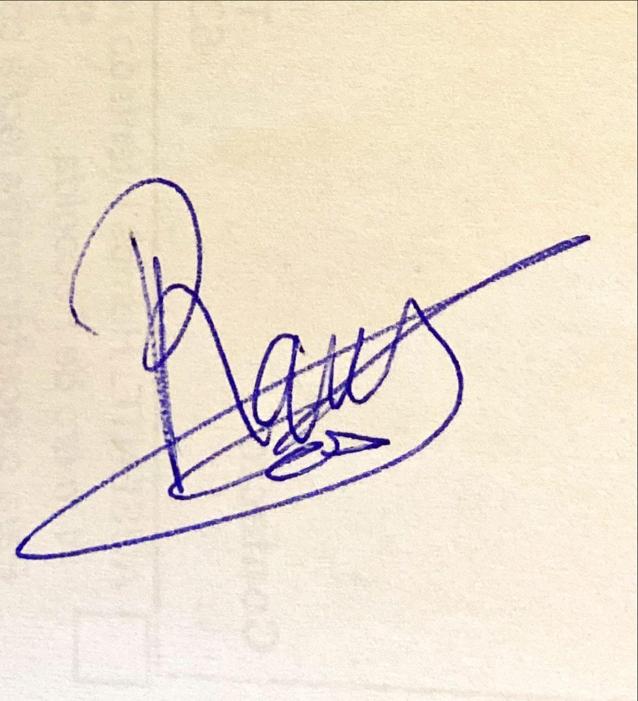
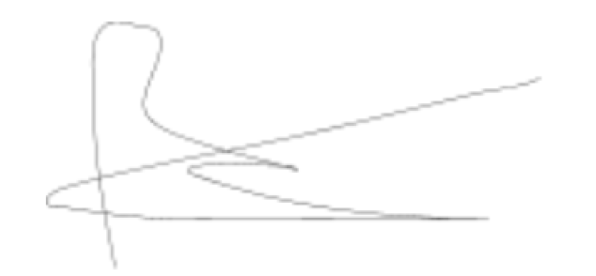
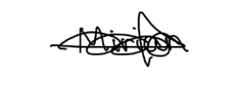
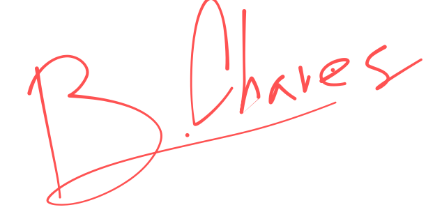

# Commitment Agreement - Pilot Users

**Fecha:** 26/03/2025  
**Grupo 8:** Infantem  
**Sprint 2**

## Integrantes del Grupo

  

    <ul style="padding-left: 0; list-style: none;">
      <li>Álvaro Jiménez Osuna</li>
      <li>Ángela López Oliva</li>
      <li>Antonio Jiménez Ortega</li>
      <li>Daniel del Castillo Piñero</li>
      <li>David Fuentelsaz Rodríguez</li>
      <li>David Vargas Muñiz</li>
      <li>Enrique García Abadía</li>
      <li>Felipe Solís Agudo</li>
      <li>Javier Santos Martín</li>
    </ul>
  

  

    <ul style="padding-left: 0; list-style: none;">
    <li>Javier Ulecia García</li>
      <li>José García de Tejada Delgado</li>
      <li>Jose Maria Morgado Prudencio</li>
      <li>Josué Rodríguez López</li>
      <li>Lucía Noya Cano</li>
      <li>Luis Giraldo Santiago</li>
      <li>Miguel Galán Lerate</li>
      <li>Paula Luna Navarro</li>
    </ul>
  

---

## Índice
1. [Información a completar por el Usuario Piloto](#información-del-usuario)
2. [Compromiso del Usuario Piloto](#compromiso-del-usuario-piloto)
   - 2.1. [Uso del Sistema](#uso-del-sistema)
   - 2.2. [Participación en Reuniones y Encuestas](#participación-en-reuniones-y-encuestas)
   - 2.3. [Informe de Incidentes](#informe-de-incidentes)
   - 2.4. [Confidencialidad y Colaboración](#confidencialidad-y-colaboración)
   - 2.5. [Cumplimiento del Proceso de Trabajo](#cumplimiento-del-proceso-de-trabajo)
   - 2.6. [Uso del Feedback](#uso-del-feedback)
   - 2.7. [Seguimiento de Progreso](#seguimiento-de-progreso)
   - 2.8. [Pruebas Exhaustivas](#pruebas-exhaustivas)
   - 2.9. [Sugerencias Constructivas](#sugerencias-constructivas)
   - 2.10. [Documentación de Casos de Uso](#documentación-de-casos-de-uso)
   - 2.11. [Retroalimentación sobre Interfaz de Usuario](#retroalimentación-sobre-interfaz-de-usuario)
3. [Firma del Usuario](#firma-del-usuario)
---

## Colaboradores del documento
- **Lucía Noya Cano**
- **Paula Luna Navarro:**
**Creó el documento.**
- **Revisado por Felipe Solís Agudo**

---

## Información a completar por el Usuario Piloto
- **Nombre:** [Nombre del Usuario]
- **Fecha:** [DD/MM/AAAA]
- **Versión del Proyecto:** 1.0
- **Grupo de Trabajo:** [Grupo de trabajo correspondiente]

## Compromiso del Usuario Piloto
Como usuario piloto del proyecto Infantem, me comprometo a colaborar activamente en la fase de pruebas del sistema. Acepto los términos establecidos en este documento y en el documento "Proceso de Participación Usuarios Piloto", y me comprometo a cumplir con las siguientes responsabilidades para contribuir al éxito del proyecto.

### 2.1. Uso del Sistema
Me comprometo a explorar y utilizar la plataforma de forma exhaustiva durante el período asignado. Evaluaré su desempeño, reportaré errores y proporcionaré retroalimentación útil para su mejora continua.

### 2.2. Participación en Reuniones y Encuestas
Me comprometo a asistir a todas las reuniones programadas y a participar en encuestas o entrevistas que el equipo del proyecto organice, con el fin de proporcionar información valiosa sobre el sistema.

### 2.3. Informe de Incidentes
Me comprometo a registrar cualquier error, fallo o problema que detecte durante el uso del sistema. Notificaré estos incidentes utilizando los canales definidos por el equipo del proyecto, completando también los formularios correspondientes para cada Sprint.

### 2.4. Confidencialidad y Colaboración
Me comprometo a mantener la confidencialidad de toda la información del proyecto. No compartiré detalles sobre el funcionamiento, características ni resultados de las pruebas sin la autorización explícita del equipo responsable.

### 2.5. Cumplimiento del Proceso de Trabajo
Me comprometo a seguir el procedimiento de trabajo establecido en el documento "Feedback Usuarios Piloto". Esto incluye asistir puntualmente a las reuniones, entregar comentarios dentro de los plazos establecidos y usar los canales de comunicación definidos por el equipo.

### 2.6. Uso del Feedback
Autorizo al equipo del proyecto a utilizar mis comentarios y los datos obtenidos durante el período de prueba para mejorar el sistema. Reconozco que no recibiré compensación adicional por mi participación ni reclamaré derechos sobre el producto final.

### 2.7. Seguimiento de Progreso
Me comprometo a realizar un seguimiento de mi progreso durante el uso del sistema y a proporcionar actualizaciones sobre cualquier problema recurrente o áreas de mejora que detecte, para que el equipo pueda priorizar las correcciones y mejoras.

### 2.8. Pruebas Exhaustivas
Me comprometo a realizar pruebas exhaustivas de todas las funcionalidades del sistema, según las directrices proporcionadas por el equipo. Esto incluirá realizar pruebas en diferentes dispositivos y navegadores (si es aplicable) para asegurar la compatibilidad y el rendimiento del sistema.

### 2.9. Sugerencias Constructivas
Me comprometo a proporcionar sugerencias constructivas que puedan mejorar la experiencia de usuario, la usabilidad y el rendimiento del sistema. Reconozco que mi opinión es clave para identificar áreas de mejora y contribuir a la evolución del producto.

### 2.10. Documentación de Casos de Uso
Me comprometo a documentar cualquier caso de uso inesperado o situación que no esté cubierta en las pruebas iniciales, lo que permitirá al equipo ajustar el sistema según sea necesario.

### 2.11. Retroalimentación sobre Interfaz de Usuario
Me comprometo a proporcionar comentarios sobre la interfaz de usuario (UI), incluyendo la facilidad de navegación, diseño visual, accesibilidad y cualquier inconveniente relacionado con la interacción con el sistema.

---
### Usuarios Piloto

### 1. **Natalia Olmo**

   "Yo, como usuario piloto, me comprometo a participar activamente en las pruebas y proporcionar retroalimentación honesta y detallada."

   Firma: 

   

   Fecha: 12/03/2023

### 2. **Antonio Macías**

   "Yo, como usuario piloto, me comprometo a utilizar la aplicación siguiendo las indicaciones del equipo y a reportar cualquier incidencia encontrada."

   Firma: 
   
   

   Fecha: 12/03/2023

### 3. **Ramón Gavira**

   "Yo, como usuario piloto, me comprometo a evaluar el funcionamiento del sistema y a compartir mis observaciones con el equipo de desarrollo."

  Firma: 

   

   Fecha: 12/03/2023

### 4. **Alberto Carmona**

   "Yo, como usuario piloto, me comprometo a probar la aplicación en distintos escenarios y a contribuir con sugerencias para su mejora."

Firma: 
   
   

   Fecha: 12/03/2023

### 5. **Santiago Rosado**

   "Yo, como usuario piloto, me comprometo a brindar un análisis detallado de mi experiencia con la aplicación para optimizar su rendimiento."

  Firma: 
  
  

   Fecha: 12/03/2023

### 6. **Raúl Heras**

   "Yo, como usuario piloto, me comprometo a participar en las pruebas y a proporcionar comentarios constructivos sobre el funcionamiento del sistema."

   Firma: 
  
  

   Fecha: 12/03/2023

### 7. **Maria Caso**

   Firma: (no aporto firma)

   Fecha: ______________________

### 8. **Miriam Santiago**

   "Yo, como usuario piloto, me comprometo a utilizar la aplicación de manera responsable y a comunicar cualquier problema técnico detectado."

   Firma: 
  
  

   Fecha: 13/03/2023

### 9. **Bea Chaves**

   "Yo, como usuario piloto, me comprometo a participar activamente en la evaluación del sistema y a sugerir mejoras según mi experiencia."

  Firma: 
  
  

   Fecha: 13/03/2023
