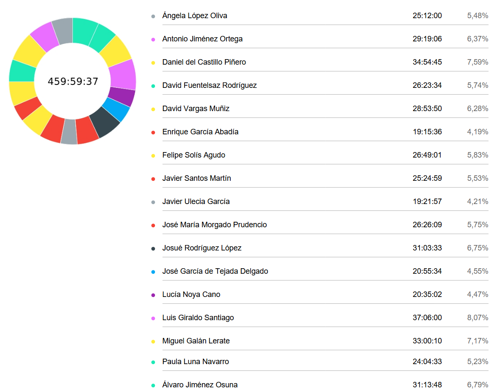

# Revision

**Fecha:** 26/03/2025  
**Grupo 8:** Infantem  
**Sprint 2**

## Integrantes del Grupo

  

    <ul style="padding-left: 0; list-style: none;">
      <li>Álvaro Jiménez Osuna</li>
      <li>Ángela López Oliva</li>
      <li>Antonio Jiménez Ortega</li>
      <li>Daniel del Castillo Piñero</li>
      <li>David Fuentelsaz Rodríguez</li>
      <li>David Vargas Muñiz</li>
      <li>Enrique García Abadía</li>
      <li>Felipe Solís Agudo</li>
      <li>Javier Santos Martín</li>
    </ul>
  

  

    <ul style="padding-left: 0; list-style: none;">
    <li>Javier Ulecia García</li>
      <li>José García de Tejada Delgado</li>
      <li>Jose Maria Morgado Prudencio</li>
      <li>Josué Rodríguez López López López</li>
      <li>Lucía Noya Cano</li>
      <li>Luis Giraldo Santiago</li>
      <li>Miguel Galán Lerate</li>
      <li>Paula Luna Navarro</li>
    </ul>
  

## Colaboradores del documento
- Josué Rodríguez López López
  - Creó la versión inicial del documento
---

## Índice
- [Resumen del tiempo invertido por el equipo](#resumen-del-tiempo-invertido-por-el-equipo)
- [Informe detallado de las horas invertidas por cada miembro del equipo](#informe-detallado-de-las-horas-invertidas-por-cada-miembro-del-equipo)
  - [Ángela López Oliva](#ángela-lópez-oliva)
  - [Antonio Jiménez Ortega](#antonio-jiménez-ortega)
  - [Daniel del Castillo Piñero](#daniel-del-castillo-piñero)
  - [David Fuentelsaz Rodríguez](#david-fuentelsaz-rodríguez)
  - [David Vargas Muñiz](#david-vargas-muñiz)
  - [Enrique García Abadía](#enrique-garcía-abadía)
  - [Felipe Solís Agudo](#felipe-solís-agudo)
  - [Javier Santos Martín](#javier-santos-martín)
  - [Javier Ulecia García](#javier-ulecia-garcía)
  - [José María Morgado Prudencio](#jose-maria-morgado-prudencio)
  - [Josué Rodríguez López López López](#josué-rodríguez-lópez-lópez)
  - [José García de Tejada Delgado](#josé-garcía-de-tejada-delgado)
  - [Lucía Noya Cano](#lucía-noya-cano)
  - [Luis Giraldo Santiago](#luis-giraldo-santiago)
  - [Miguel Galán Lerate](#miguel-galán-lerate)
  - [Paula Luna Navarro](#paula-luna-navarro)
  - [Álvaro Jiménez Osuna](#álvaro-jiménez-osuna)

## Resumen del tiempo invertido por el equipo

## Informe detallado de las horas invertidas por cada miembro del equipo

#### Ángela López Oliva
| Usuario                       | Tarea                           | Descripción                                                                                                         | Duración (h) |
|-------------------------------|---------------------------------|---------------------------------------------------------------------------------------------------------------------|--------------|
| Ángela López Oliva            |                                 | Repaso visual frontend                                                                                              |     00:46:57 |
| Ángela López Oliva            | Presentación                    | Presentación                                                                                                        |     01:06:25 |
| Ángela López Oliva            |                                 | Editar pantalla inicial Frontend                                                                                    |     01:08:37 |
| Ángela López Oliva            |                                 | Editar pantalla inicial Frontend                                                                                    |     01:17:12 |
| Ángela López Oliva            |                                 | Editar Recetas Frontend                                                                                             |     00:39:31 |
| Ángela López Oliva            |                                 | Editar detail receta frontend                                                                                       |     00:50:29 |
| Ángela López Oliva            |                                 | Revisión Screens                                                                                                    |     00:38:44 |
| Ángela López Oliva            | Codigo                          | Editar bebé Frontend                                                                                                |     00:17:29 |
| Ángela López Oliva            | Codigo                          | Recetas Frontend                                                                                                    |     00:48:07 |
| Ángela López Oliva            | Presentación                    | Presentación                                                                                                        |     02:06:29 |
| Ángela López Oliva            | Presentación                    | Presentación                                                                                                        |     00:38:50 |
| Ángela López Oliva            | Codigo                          | Recetas Frontend                                                                                                    |     01:38:14 |
| Ángela López Oliva            | Codigo                          | Bebes Frontend                                                                                                      |     00:49:09 |
| Ángela López Oliva            | Clases                          | Clase                                                                                                               |     04:00:00 |
| Ángela López Oliva            | Presentación                    | Presentación                                                                                                        |     00:10:36 |
| Ángela López Oliva            |                                 | Reunión de presentación                                                                                             |     00:10:02 |
| Ángela López Oliva            | Presentación                    | Presentación                                                                                                        |     00:42:49 |
| Ángela López Oliva            | Clases                          | Clase                                                                                                               |     04:00:00 |
| Ángela López Oliva            | Codigo                          | Log-in Frontend                                                                                                     |     00:27:43 |
| Ángela López Oliva            | Codigo                          | Sing-up Frontend                                                                                                    |     00:28:39 |
| Ángela López Oliva            | Codigo                          | Bebes Frontend                                                                                                      |     00:23:57 |
| Ángela López Oliva            | Codigo                          | Cuenta Frontend                                                                                                     |     00:29:33 |
| Ángela López Oliva            | Codigo                          | Cuenta Frontend                                                                                                     |     00:58:01 |
| Ángela López Oliva            | Codigo                          | Crear Bebe Frontend                                                                                                 |     00:30:16 |
| Ángela López Oliva            | Presentación                    | Presentación                                                                                                        |     00:04:11 |

#### Antonio Jiménez Ortega
| Usuario                       | Tarea                           | Descripción                                                                                | Duración (h) |
|-------------------------------|---------------------------------|--------------------------------------------------------------------------------------------|----------------|
| Antonio Jiménez Ortega        | Codigo                          | Some fixes in payment                                                                                               |     01:40:22 |
| Antonio Jiménez Ortega        | Codigo                          | Mejorar manejo de errores form signup                                                                               |     01:10:36 |
| Antonio Jiménez Ortega        | Codigo                          | Test show user recipes                                                                                              |     00:21:28 |
| Antonio Jiménez Ortega        | Documentos                      | Impacto legal del proyecto                                                                                          |     00:48:35 |
| Antonio Jiménez Ortega        | Presentación                    | Grabar video demo app (sin sonido)   para el viernes                                                                |     00:25:29 |
| Antonio Jiménez Ortega        | Presentación                    | Grabar video demo app (sin sonido)   para el viernes                                                                |     02:22:20 |
| Antonio Jiménez Ortega        | Codigo                          | Test show user recipes                                                                                              |     02:30:46 |
| Antonio Jiménez Ortega        | Codigo                          | Frontend términos y condiciones   legales                                                                           |     04:05:00 |
| Antonio Jiménez Ortega        | Codigo                          | Mejorar manejo de errores form signup                                                                               |     01:57:21 |
| Antonio Jiménez Ortega        | Codigo                          | Mejorar manejo de errores form signup                                                                               |     01:21:00 |
| Antonio Jiménez Ortega        | Usuario Piloto de Grupo Externo | Usuario piloto                                                                                                      |     00:30:00 |
| Antonio Jiménez Ortega        | Codigo                          | Revisar PR pago de Luis                                                                                             |     01:09:00 |
| Antonio Jiménez Ortega        | Codigo                          | Mejorar manejo de errores form signup                                                                               |     00:46:59 |
| Antonio Jiménez Ortega        | Codigo                          | Test show user recipes                                                                                              |     02:21:23 |
| Antonio Jiménez Ortega        | Asistencia a clase              | Revisión S1                                                                                                         |     03:49:00 |
| Antonio Jiménez Ortega        | Codigo                          | Revisar y arreglar posibles   hardcodeos                                                                            |     00:49:00 |
| Antonio Jiménez Ortega        | Codigo                          | Arreglar search de recetas del   usuario                                                                            |     00:32:17 |
| Antonio Jiménez Ortega        | Codigo                          | Arreglar search de recetas del   usuario                                                                            |     01:34:36 |
| Antonio Jiménez Ortega        | Codigo                          | Fix recetas                                                                                                         |     01:03:54 |

#### Daniel del Castillo Piñero
| Usuario                       | Tarea                           | Descripción                                                                                | Duración (h) |
|-------------------------------|---------------------------------|--------------------------------------------------------------------------------------------|--------------|
| Daniel del Castillo Piñero    | Reuniones                       | Reunión vocales 26/03                                                                                               |     01:29:39 |
| Daniel del Castillo Piñero    | Codigo                          | Revisión de la aplicación antes del   despliegue                                                                    |     00:05:43 |
| Daniel del Castillo Piñero    | Codigo                          | Revisión de la aplicación antes del   despliegue                                                                    |     00:13:12 |
| Daniel del Castillo Piñero    | Codigo                          | Solucionar problemas en la vista de   recetas                                                                       |     01:00:51 |
| Daniel del Castillo Piñero    | Presentación                    | Reunión de presentación                                                                                             |     00:09:53 |
| Daniel del Castillo Piñero    | Reuniones                       | Reunión vocales 24/03                                                                                               |     00:53:37 |
| Daniel del Castillo Piñero    | Codigo                          | Implementar publicidad en la   aplicación                                                                           |     01:07:54 |
| Daniel del Castillo Piñero    | Reuniones                       | Reunión de vocales 22/03                                                                                            |     00:45:05 |
| Daniel del Castillo Piñero    | Documentos                      | Graficas de costes                                                                                                  |     00:04:27 |
| Daniel del Castillo Piñero    | Presentación                    | Presentación                                                                                                        |     00:26:24 |
| Daniel del Castillo Piñero    | Codigo                          | Refactorizar y limpiar la vista   recipes                                                                           |     02:05:10 |
| Daniel del Castillo Piñero    | Codigo                          | Revision de la pull request fix:   Add/Edit Baby                                                                    |     00:06:09 |
| Daniel del Castillo Piñero    | Codigo                          | Revision de la pull request fix:   Add/Edit Baby                                                                    |     00:08:03 |
| Daniel del Castillo Piñero    | Reuniones                       | Reunión vocales 17/03                                                                                               |     00:37:52 |
| Daniel del Castillo Piñero    | Clases                          | Clase 14/03                                                                                                         |     04:00:00 |
| Daniel del Castillo Piñero    | Codigo                          | Modificar profile                                                                                                   |     00:34:05 |
| Daniel del Castillo Piñero    | Codigo                          | Modificar profile                                                                                                   |     01:49:01 |
| Daniel del Castillo Piñero    | Codigo                          | Rediseñar vista recipeDetails y   favorites con información del backend                                             |     01:13:11 |
| Daniel del Castillo Piñero    | Documentos                      | Planteamiento de las storyboards                                                                                    |     00:20:17 |
| Daniel del Castillo Piñero    | Codigo                          | Change database to realistic values                                                                                 |     00:44:07 |
| Daniel del Castillo Piñero    | Codigo                          | Revision de la pull request fix:   Add/Edit Baby                                                                    |     00:15:01 |
| Daniel del Castillo Piñero    | Reuniones                       | Reunión vocales 19/03                                                                                               |     00:36:29 |
| Daniel del Castillo Piñero    | Planificación                   | Limpieza github project                                                                                             |     00:16:46 |
| Daniel del Castillo Piñero    | Codigo                          | Funcionalidad editar recetas                                                                                        |     01:18:14 |
| Daniel del Castillo Piñero    | Presentación                    | Estado del proyecto frente a la   presentación                                                                      |     00:33:17 |
| Daniel del Castillo Piñero    | Codigo                          | Fix en la ruta de RecipeController                                                                                  |     00:11:48 |
| Daniel del Castillo Piñero    | Codigo                          | Modiicando los estilos de la   aplicación                                                                           |     00:16:48 |
| Daniel del Castillo Piñero    | Codigo                          | Modiicando los estilos de la   aplicación y corrigiendo bugs en recipedetail                                        |     02:15:01 |
| Daniel del Castillo Piñero    | Documentos                      | Actualizar MSProject                                                                                                |     01:29:20 |
| Daniel del Castillo Piñero    | Documentos                      | Graficas de costesd                                                                                                 |     00:09:07 |
| Daniel del Castillo Piñero    | Documentos                      | Storyboards                                                                                                         |     00:23:44 |
| Daniel del Castillo Piñero    | Presentación                    | Revisión de la presentación                                                                                         |     00:42:05 |
| Daniel del Castillo Piñero    | Clases                          | Clase 21/03                                                                                                         |     02:00:00 |
| Daniel del Castillo Piñero    | Reuniones                       | Reunión frontend para planificar la   publicidad                                                                    |     00:16:56 |
| Daniel del Castillo Piñero    | Codigo                          | Revisión de pull requests                                                                                           |     00:18:14 |
| Daniel del Castillo Piñero    | Codigo                          | Corrección loading en la página de   index de la aplicación                                                         |     00:10:27 |
| Daniel del Castillo Piñero    | Codigo                          | Corrección loading en la página de   index de la aplicación                                                         |     00:09:09 |
| Daniel del Castillo Piñero    | Codigo                          | Implementar publicidad en la   aplicación                                                                           |     00:06:49 |
| Daniel del Castillo Piñero    | Codigo                          | Implementar publicidad en la   aplicación                                                                           |     00:47:27 |
| Daniel del Castillo Piñero    | Documentos                      | Actualización MSProject                                                                                             |     00:55:50 |
| Daniel del Castillo Piñero    | Codigo                          | Implementar publicidad en la   aplicación                                                                           |     00:32:26 |
| Daniel del Castillo Piñero    | Presentación                    | Generación de gráficas para la   presentación                                                                       |     00:14:15 |
| Daniel del Castillo Piñero    | Planificación                   | Investigar confirmación y existencia   de email                                                                     |     00:09:55 |
| Daniel del Castillo Piñero    | Codigo                          | Modiicando los estilos de la   aplicación                                                                           |     00:12:30 |
| Daniel del Castillo Piñero    | Presentación                    | Generación de gráficas para la   presentación                                                                       |     00:37:24 |
| Daniel del Castillo Piñero    | Planificación                   | Ponderar tareas para gráficas                                                                                       |     00:32:29 |
| Daniel del Castillo Piñero    | Codigo                          | Ultimos arreglos                                                                                                    |     01:28:34 |

#### David Fuentelsaz Rodríguez
| Usuario                       | Tarea                           | Descripción                                                                                | Duración (h) |
|-------------------------------|---------------------------------|--------------------------------------------------------------------------------------------|--------------|
| David Fuentelsaz Rodríguez    | Codigo                          | #73 Desarrollo backend del registro   de ingestas                                                                   |     00:45:01 |
| David Fuentelsaz Rodríguez    | Codigo                          | #73 Desarrollo backend del registro   de ingestas                                                                   |     00:18:50 |
| David Fuentelsaz Rodríguez    | Codigo                          | #175 Corregir validaciones generales   del backend                                                                  |     01:16:44 |
| David Fuentelsaz Rodríguez    | Codigo                          | #175 Corregir validaciones generales   del backend                                                                  |     01:09:31 |
| David Fuentelsaz Rodríguez    | Codigo                          | #175 Corregir validaciones generales   del backend                                                                  |     01:05:51 |
| David Fuentelsaz Rodríguez    |                                 | Reunión 15/03                                                                                                       |     02:00:00 |
| David Fuentelsaz Rodríguez    | Clases                          | Clase 14/03                                                                                                         |     04:00:00 |
| David Fuentelsaz Rodríguez    | Reuniones                       | Reunión backend                                                                                                     |     00:12:40 |
| David Fuentelsaz Rodríguez    | Documentos                      | Acta                                                                                                                |     00:15:33 |
| David Fuentelsaz Rodríguez    | Codigo                          | #175 Corregir validaciones generales   del backend                                                                  |     00:56:07 |
| David Fuentelsaz Rodríguez    | Codigo                          | #175 Corregir validaciones generales   del backend                                                                  |     01:31:55 |
| David Fuentelsaz Rodríguez    | Codigo                          | #175 Corregir validaciones generales   del backend                                                                  |     01:31:21 |
| David Fuentelsaz Rodríguez    | Codigo                          | #175 Corregir validaciones generales   del backend                                                                  |     00:43:49 |
| David Fuentelsaz Rodríguez    | Codigo                          | #175 Corregir validaciones generales   del backend                                                                  |     00:16:53 |
| David Fuentelsaz Rodríguez    | Codigo                          | #175 Corregir validaciones generales   del backend                                                                  |     00:57:14 |
| David Fuentelsaz Rodríguez    | Asistencia a clase              | Clase 21/03                                                                                                         |     04:00:00 |
| David Fuentelsaz Rodríguez    | Codigo                          | #73 Desarrollo backend del registro   de ingestas                                                                   |     00:00:48 |
| David Fuentelsaz Rodríguez    | Codigo                          | #73 Desarrollo backend del registro   de ingestas                                                                   |     02:00:55 |
| David Fuentelsaz Rodríguez    | Codigo                          | #73 Desarrollo backend del registro   de ingestas                                                                   |     01:54:53 |
| David Fuentelsaz Rodríguez    | Reuniones                       | Reunión Control 26/03                                                                                               |     01:25:29 |

#### David Vargas Muñiz
| Usuario                       | Tarea                           | Descripción                                                                                | Duración (h) |
|-------------------------------|---------------------------------|--------------------------------------------------------------------------------------------|--------------|
| David Vargas Muñiz            | Codigo                          | Arreglo test de Selenium                                                                                            |     01:14:46 |
| David Vargas Muñiz            | Videos de clase                 | ISPP - Sesión 06 (10:56)                                                                                            |     00:11:55 |
| David Vargas Muñiz            | Presentación                    | Preparar presentación 28/03/2025                                                                                    |     00:20:46 |
| David Vargas Muñiz            | Codigo                          | Testing parte de recetas                                                                                            |     01:27:59 |
| David Vargas Muñiz            | Presentación                    | Repasar presentación                                                                                                |     00:16:44 |
| David Vargas Muñiz            | Presentación                    | Preparar presentación 28/03/2025                                                                                    |     00:19:34 |
| David Vargas Muñiz            | Codigo                          | Testing parte de recetas                                                                                            |     00:28:42 |
| David Vargas Muñiz            | Presentación                    | Preparar presentación 28/03/2025                                                                                    |     00:45:30 |
| David Vargas Muñiz            | Videos de clase                 | ISPP - Session 07a (35:33)                                                                                          |     00:12:39 |
| David Vargas Muñiz            | Videos de clase                 | ISPP - Session 07a (35:33)                                                                                          |     00:24:31 |
| David Vargas Muñiz            | Videos de clase                 | ISPP - Session 07b (37:27)                                                                                          |     00:38:21 |
| David Vargas Muñiz            | Presentación                    | Preparar presentación 28/03/2025                                                                                    |     01:17:38 |
| David Vargas Muñiz            | Presentación                    | Preparar presentación 28/03/2025                                                                                    |     00:46:02 |
| David Vargas Muñiz            | Presentación                    | Preparar presentación 21/03/2025                                                                                    |     02:22:50 |
| David Vargas Muñiz            | Codigo                          | Juntar funcionalidades Add baby y   Edit baby en la misma vista #209                                                |     00:15:44 |
| David Vargas Muñiz            | Codigo                          | Juntar funcionalidades Add baby y   Edit baby en la misma vista #209                                                |     00:45:24 |
| David Vargas Muñiz            |                                 | Clase 14/03/2025                                                                                                    |     04:00:00 |
| David Vargas Muñiz            | Codigo                          | Juntar funcionalidades Add baby y   Edit baby en la misma vista #209                                                |     02:44:46 |
| David Vargas Muñiz            | Presentación                    | Preparar presentación 21/03/2025                                                                                    |     00:18:22 |
| David Vargas Muñiz            | Codigo                          | Arreglar errores de linters en la   vista bebé #214                                                                 |     00:05:36 |
| David Vargas Muñiz            | Presentación                    | Preparar presentación 21/03/2025                                                                                    |     00:15:54 |
| David Vargas Muñiz            | Presentación                    | Preparar presentación 21/03/2025                                                                                    |     02:00:07 |
| David Vargas Muñiz            | Asistencia a clase              | Clase 21/03/2025                                                                                                    |     04:00:00 |
| David Vargas Muñiz            | Presentación                    | Preparar presentación 28/03/2025                                                                                    |     03:40:00 |

#### Enrique García Abadía
| Usuario                       | Tarea                           | Descripción                                                                                | Duración (h) |
|-------------------------------|---------------------------------|--------------------------------------------------------------------------------------------|--------------|
| Enrique García Abadía         | Codigo                          | #240 Implementación frontend   Calendario                                                                           |     02:55:00 |
| Enrique García Abadía         | Codigo                          | #240 Implementación frontend   Calendario                                                                           |     02:36:00 |
| Enrique García Abadía         | Codigo                          | #240 Implementación frontend   Calendario                                                                           |     02:17:00 |
| Enrique García Abadía         | Documentos                      | Generación de acta mediante IA de   reunión día 22/03                                                               |     00:12:00 |
| Enrique García Abadía         | Reuniones                       | Reunión vocales día 15/03                                                                                           |     02:00:00 |
| Enrique García Abadía         | Clases                          | Clase día 14/03                                                                                                     |     03:15:00 |
| Enrique García Abadía         | Documentos                      | #188 Investigación sobre la   implementación del calendario en Frontend                                             |     02:38:00 |
| Enrique García Abadía         | Documentos                      | #188 Investigación sobre la   implementación del calendario en Frontend                                             |     00:21:36 |
| Enrique García Abadía         | Reuniones                       | Reunión vocales día 22/03                                                                                           |     00:48:00 |
| Enrique García Abadía         | Documentos                      | Analisis de Costes                                                                                                  |     02:13:00 |

#### Felipe Solís Agudo
| Usuario                       | Tarea                           | Descripción                                                                                | Duración (h) |
|-------------------------------|---------------------------------|--------------------------------------------------------------------------------------------|--------------|
| Felipe Solís Agudo            | Clases                          | Clase 21/03/2025                                                                                                    |     04:00:00 |
| Felipe Solís Agudo            | Codigo                          | Implementación sistema de Pago   frontend                                                                           |     00:05:46 |
| Felipe Solís Agudo            | Codigo                          | Implementación sistema de Pago   frontend                                                                           |     01:04:24 |
| Felipe Solís Agudo            | Codigo                          | Revisión distintas pull request                                                                                     |     00:06:48 |
| Felipe Solís Agudo            | Codigo                          | Ajuste .env y error mysql despliegue   proyecto                                                                     |     00:20:46 |
| Felipe Solís Agudo            | Documentos                      | Firma CA usuarios piloto grupo 3   EventBride                                                                       |     00:04:00 |
| Felipe Solís Agudo            | Reuniones                       | División tareas frontend S2                                                                                         |     00:12:45 |
| Felipe Solís Agudo            | Clases                          | Clase teoría evaluación S1 14/03/2025                                                                               |     04:00:00 |
| Felipe Solís Agudo            | Reuniones                       | Reunión planificación S2                                                                                            |     02:00:06 |
| Felipe Solís Agudo            | Codigo                          | Review feat/auth pull request ->   develop                                                                          |     00:05:25 |
| Felipe Solís Agudo            | Documentos                      | Feedback resto de grupos sesión 14/03   S1 añadido a docs para base de conocimiento común                           |     00:15:18 |
| Felipe Solís Agudo            | Reuniones                       | Reunión vocales estudiar desarrollo   de tareas + Explicación backend sistema de pago                               |     00:43:39 |
| Felipe Solís Agudo            |                                 | Formulario 2 usuarios piloto   EventBride grupo 3                                                                   |     00:32:46 |
| Felipe Solís Agudo            | Codigo                          | Implementación sistema de pago   frontend                                                                           |     01:06:44 |
| Felipe Solís Agudo            | Codigo                          | Implementación sistema de pago   frontend                                                                           |     00:30:47 |
| Felipe Solís Agudo            |                                 | Revisión pull request SonarCloud +   Commits primeros steps payment system + Actualización Github Project           |     00:08:12 |
| Felipe Solís Agudo            | Reuniones                       | Reunión vocales revisión estado S2                                                                                  |     00:34:34 |
| Felipe Solís Agudo            | Codigo                          | Implementación sistema de Pago   frontend                                                                           |     00:24:07 |
| Felipe Solís Agudo            | Codigo                          | Modificaciones sistema de Pago   Frontend                                                                           |     01:34:47 |
| Felipe Solís Agudo            | Planificación                   | Investigación publicidad aplicación                                                                                 |     00:19:01 |
| Felipe Solís Agudo            | Planificación                   | Reunión mitad de S2 + revisión   implementación publicidad Frontend                                                 |     01:04:57 |
| Felipe Solís Agudo            | Planificación                   | Asignación tareas frontend en función   de tiempo y disponibilidad de los miembros del grupo                        |     00:07:09 |
| Felipe Solís Agudo            | Documentos                      | Revisión docs 2.0pilotsUsers.md,   2.0pilotUserscommitmentAgreement, 2.0pilotUsersPerformanceEvaluation             |     00:12:52 |
| Felipe Solís Agudo            | Reuniones                       | Reunión final S2                                                                                                    |     01:30:28 |
| Felipe Solís Agudo            | Documentos                      | Revisión docs S2   pilotuserPerformanceEvaluation, pilotUsers, commitmentAgreement y   pilotUserCommitmentAgreement |     00:08:00 |
| Felipe Solís Agudo            | Documentos                      | Revisión docs 2.0-AIUsage.md,   2.0-commitmentAgreement y revisión y actualización de 2.0-KBreport.md               |     00:43:41 |
| Felipe Solís Agudo            | Videos de clase                 | ISPP - Sesión 06 (10:56)                                                                                            |     00:10:54 |
| Felipe Solís Agudo            | Videos de clase                 | ISPP - Session 07b (37:27)                                                                                          |     00:37:11 |
| Felipe Solís Agudo            | Videos de clase                 | ISPP - Session 07a (35:33)                                                                                          |     00:35:20 |
| Felipe Solís Agudo            | Codigo                          | Test LoginLogut frontend arreglo   final                                                                            |     00:17:29 |
| Felipe Solís Agudo            | Codigo                          | Error backend base de datos                                                                                         |     00:17:33 |
| Felipe Solís Agudo            | Codigo                          | Test frontend selenium sistema LogIn                                                                                |     01:05:23 |
| Felipe Solís Agudo            | Codigo                          | Test frontend selenium sistema LogIn                                                                                |     00:07:37 |
| Felipe Solís Agudo            | Reuniones                       | Reunión vocales gestión S2                                                                                          |     00:38:37 |
| Felipe Solís Agudo            | Codigo                          | Test Singup                                                                                                         |     00:19:58 |
| Felipe Solís Agudo            | Codigo                          | Test Singup                                                                                                         |     00:22:19 |
| Felipe Solís Agudo            | Planificación                   | Gestión documentación y presentación                                                                                |     00:19:38 |

#### Javier Santos Martín
| Usuario                       | Tarea                           | Descripción                                                                                | Duración (h) |
|-------------------------------|---------------------------------|--------------------------------------------------------------------------------------------|--------------|
| Javier Santos Martín          | Codigo                          | Revisando Pull Request (front+back)                                                                                 |     00:59:03 |
| Javier Santos Martín          | Codigo                          | Revisando Pull Request (front+back)                                                                                 |     02:30:09 |
| Javier Santos Martín          | Codigo                          | Arreglar errores frontend                                                                                           |     00:47:29 |
| Javier Santos Martín          | Codigo                          | Añadiendo publicidad a la aplicación                                                                                |     00:35:09 |
| Javier Santos Martín          | Reuniones                       | Reunion control Mar 24                                                                                         Ángela López Oliva     |     00:49:12 |
| Javier Santos Martín          | Codigo                          | Añadiendo publicidad a la aplicación                                                                                |     01:02:25 |
| Javier Santos Martín          | Codigo                          | Añadiendo publicidad a la aplicación                                                                                |     01:37:11 |
| Javier Santos Martín          | Codigo                          | Añadiendo publicidad a la aplicación                                                                                |     02:39:59 |
| Javier Santos Martín          | Codigo                          | Debuggeando un redirect inesperado en   checkAuth (frontend)                                                        |     00:34:37 |
| Javier Santos Martín          | Clases                          | Clase 14/03                                                                                                         |     04:00:00 |
| Javier Santos Martín          | Reuniones                       | Reunion vocales Mar 15                                                                                              |     02:12:12 |
| Javier Santos Martín          | Codigo                          | Refactorizacion de todo el auth en   cliente                                                                        |     01:29:12 |
| Javier Santos Martín          | Reuniones                       | Reunion vocales Mar 17                                                                                              |     00:35:12 |
| Javier Santos Martín          | Codigo                          | Revisando PR                                                                                                        |     00:15:27 |
| Javier Santos Martín          | Codigo                          | Añadiendo publicidad a la aplicación                                                                                |     01:46:34 |
| Javier Santos Martín          | Codigo                          | Fixing baby delete                                                                                                  |     00:30:52 |
| Javier Santos Martín          | Codigo                          | Arreglando confirmar email                                                                                          |     03:00:16 |

#### Javier Ulecia García
| Usuario                       | Tarea                           | Descripción                                                                                | Duración (h) |
|-------------------------------|---------------------------------|--------------------------------------------------------------------------------------------|--------------|
| Javier Ulecia García          | Documentos                      | Analisis de costes, inversores                                                                                      |     01:05:38 |
| Javier Ulecia García          | Asistencia a clase              | Asistencia clase 21/03/2025                                                                                         |     04:00:00 |
| Javier Ulecia García          | Documentos                      | Actualización de los competidores   #197                                                                            |     00:22:13 |
| Javier Ulecia García          | Documentos                      | Investigar opciones de implementación   automática      #183                                                        |     00:28:54 |
| Javier Ulecia García          | Clases                          | Clase 14/03/25                                                                                                      |     04:00:00 |
| Javier Ulecia García          | Reuniones                       | Reunion 16/03/25                                                                                                    |     00:15:19 |
| Javier Ulecia García          | Documentos                      | Actualización de los competidores   #197                                                                            |     00:40:56 |
| Javier Ulecia García          | Documentos                      | Actualizar analisis de costes #219                                                                                  |     01:00:12 |
| Javier Ulecia García          | Documentos                      | Completar feedback                                                                                                  |     00:13:36 |
| Javier Ulecia García          | Documentos                      | Analisis de costes, inversores                                                                                      |     00:25:34 |
| Javier Ulecia García          | Codigo                          | test user                                                                                                           |     01:36:50 |
| Javier Ulecia García          | Codigo                          | tests baby                                                                                                          |     00:15:05 |
| Javier Ulecia García          | Codigo                          | tests baby                                                                                                          |     01:41:26 |
| Javier Ulecia García          | Codigo                          | tests baby                                                                                                          |     01:00:56 |
| Javier Ulecia García          | Codigo                          | test vaccine                                                                                                        |     00:37:30 |
| Javier Ulecia García          | Documentos                      | Analisis de costes, inversores                                                                                      |     00:27:17 |
| Javier Ulecia García          | Videos de clase                 | Videos S2                                                                                                           |     01:10:31 |

#### José María Morgado Prudencio
| Usuario                       | Tarea                           | Descripción                                                                                | Duración (h) |
|-------------------------------|---------------------------------|--------------------------------------------------------------------------------------------|--------------|
| José María Morgado Prudencio                 | Codigo                          | actualizacion documento de costes                                                                                   |     00:47:43 |
| José María Morgado Prudencio                 | Asistencia a clase              | Asistencia a Clase                                                                                                  |     04:00:00 |
| José María Morgado Prudencio                 | Documentos                      | Goverify                                                                                                            |     01:30:00 |
| José María Morgado Prudencio                 | Codigo                          | Swagger                                                                                                             |     01:40:32 |
| José María Morgado Prudencio                 | Codigo                          | Filtros de recetas                                                                                                  |     01:46:10 |
| José María Morgado Prudencio                 | Reuniones                       | Lectura actas de reunion                                                                                            |     00:18:18 |
| José María Morgado Prudencio                 | Asistencia a clase              | Asistencia a clase                                                                                                  |     04:00:00 |
| José María Morgado Prudencio                 | Codigo                          | Filtros de recetas                                                                                                  |     02:22:02 |
| José María Morgado Prudencio                 | Documentos                      | Actualizacion de Analisis de Riesgos                                                                                |     00:45:00 |
| José María Morgado Prudencio                 | Codigo                          | Swagger                                                                                                             |     01:30:00 |
| José María Morgado Prudencio                 | Usuario Piloto de Grupo Externo | Usuario Piloto G5                                                                                                   |     00:56:42 |
| José María Morgado Prudencio                 | Codigo                          | actualizacion documento de costes                                                                                   |     01:28:19 |
| José María Morgado Prudencio                 | Codigo                          | swagger                                                                                                             |     01:35:41 |
| José María Morgado Prudencio                 | Codigo                          | swagger                                                                                                             |     03:00:28 |
| José María Morgado Prudencio                 | Codigo                          | swagger                                                                                                             |     00:45:14 |

#### Josué Rodríguez López López
| Usuario                       | Tarea                           | Descripción                                                                                | Duración (h) |
|-------------------------------|---------------------------------|--------------------------------------------------------------------------------------------|--------------|
| Josué Rodríguez López               | Codigo                          | #173 Desarrollo del calendario en el   backend                                                                      |     00:55:16 |
| Josué Rodríguez López               | Codigo                          | #173 Desarrollo del calendario en el   backend                                                                      |     01:04:59 |
| Josué Rodríguez López               | Codigo                          | #53 Test backend de las   recomendaciones de recetas                                                                |     00:29:22 |
| Josué Rodríguez López               | Codigo                          | #53 Test backend de las   recomendaciones de recetas                                                                |     01:09:16 |
| Josué Rodríguez López               | Codigo                          | #173 Desarrollo del calendario en el   backend                                                                      |     00:51:01 |
| Josué Rodríguez López               | Reuniones                       | Reunión de control del sábado                                                                                       |     00:51:00 |
| Josué Rodríguez López               | Codigo                          | #173 Desarrollo del calendario en el   backend                                                                      |     00:46:49 |
| Josué Rodríguez López               | Reuniones                       | Reunión de control del miércoles                                                                                    |     01:25:04 |
| Josué Rodríguez López               | Usuario Piloto de Grupo Externo | Feedback para usuarios piloto del G4                                                                                |     00:50:55 |
| Josué Rodríguez López               | Codigo                          | Arreglar tests en backend                                                                                           |     01:36:54 |
| Josué Rodríguez López               | Codigo                          | #173 Desarrollo del calendario en el   backend                                                                      |     01:34:56 |
| Josué Rodríguez López               | Codigo                          | #173 Desarrollo del calendario en el   backend                                                                      |     00:52:36 |
| Josué Rodríguez López               | Reuniones                       | Reunión de control del lunes                                                                                        |     00:39:57 |
| Josué Rodríguez López               | Codigo                          | #173 Desarrollo del calendario en el   backend                                                                      |     02:28:59 |
| Josué Rodríguez López               | Codigo                          | #173 Desarrollo del calendario en el   backend                                                                      |     00:05:19 |
| Josué Rodríguez López               | Codigo                          | #173 Desarrollo del calendario en el   backend                                                                      |     00:02:26 |
| Josué Rodríguez López               | Codigo                          | #173 Desarrollo del calendario en el   backend                                                                      |     01:38:50 |
| Josué Rodríguez López               | Codigo                          | #173 Desarrollo del calendario en el   backend                                                                      |     00:31:36 |
| Josué Rodríguez López               | Codigo                          | #256 Manejar errores de cada input en   el signup                                                                   |     00:06:57 |
| Josué Rodríguez López               | Codigo                          | #53 Test backend de las   recomendaciones de recetas                                                                |     01:02:19 |
| Josué Rodríguez López               | Reuniones                       | Reunión de control del lunes                                                                                        |     00:24:38 |
| Josué Rodríguez López               | Reuniones                       | Reunión backend                                                                                                     |     00:14:08 |
| Josué Rodríguez López               | Calendario                      | Planificar implementación de   calendario                                                                           |     00:20:20 |
| Josué Rodríguez López               | Clases                          | Asistencia a clase                                                                                                  |     04:00:00 |
| Josué Rodríguez López               | Videos de clase                 | Visualización de píldoras teóricas                                                                                  |     00:47:00 |
| Josué Rodríguez López               | Reuniones                       | Reunión                                                                                                             |     02:01:15 |
| Josué Rodríguez López               | Planificación                   | Planificación de las tareas del   backend                                                                           |     01:12:30 |
| Josué Rodríguez López               | Reuniones                       | Reunión de control del lunes                                                                                        |     00:35:35 |
| Josué Rodríguez López               | Codigo                          | Revisión de pull request                                                                                            |     00:10:00 |
| Josué Rodríguez López               | Codigo                          | Corrección de errores                                                                                               |     02:13:36 |

#### José García de Tejada Delgado
| Usuario                       | Tarea                           | Descripción                                                                                | Duración (h) |
|-------------------------------|---------------------------------|--------------------------------------------------------------------------------------------|--------------|
| José García de Tejada Delgado |                                 | testing                                                                                                             |     00:21:17 |
| José García de Tejada Delgado |                                 | testing                                                                                                             |     00:39:21 |
| José García de Tejada Delgado |                                 | testing                                                                                                             |     01:42:01 |
| José García de Tejada Delgado |                                 | testing                                                                                                             |     01:04:08 |
| José García de Tejada Delgado |                                 | email confirmation                                                                                                  |     00:08:21 |
| José García de Tejada Delgado |                                 | testing                                                                                                             |     01:22:44 |
| José García de Tejada Delgado |                                 | authDTO                                                                                                             |     00:09:24 |
| José García de Tejada Delgado |                                 | email confirmation                                                                                                  |     00:22:14 |
| José García de Tejada Delgado |                                 | email confirmation                                                                                                  |     00:41:33 |
| José García de Tejada Delgado |                                 | email confirmation                                                                                                  |     00:31:15 |
| José García de Tejada Delgado |                                 | authDTO                                                                                                             |     00:12:41 |
| José García de Tejada Delgado |                                 | email confirmation                                                                                                  |     00:27:10 |
| José García de Tejada Delgado |                                 | allergens                                                                                                           |     01:55:56 |
| José García de Tejada Delgado |                                 | allergens                                                                                                           |     00:08:57 |
| José García de Tejada Delgado |                                 | allergens                                                                                                           |     00:20:15 |
| José García de Tejada Delgado | Codigo                          | auth vulnerability                                                                                                  |     00:58:27 |
| José García de Tejada Delgado | Clases                          | clase 15 marzo                                                                                                      |     04:00:00 |
| José García de Tejada Delgado | Codigo                          | auth/me                                                                                                             |     00:32:16 |
| José García de Tejada Delgado | Reuniones                       | reunion backend                                                                                                     |     00:15:44 |
| José García de Tejada Delgado |                                 | allergens                                                                                                           |     00:29:08 |
| José García de Tejada Delgado |                                 | allergens                                                                                                           |     00:02:47 |
| José García de Tejada Delgado |                                 | allergens                                                                                                           |     00:18:06 |
| José García de Tejada Delgado |                                 | email confirmation                                                                                                  |     02:20:19 |
| José García de Tejada Delgado |                                 | authDTO                                                                                                             |     00:16:33 |
| José García de Tejada Delgado |                                 | email confirmation                                                                                                  |     01:10:16 |
| José García de Tejada Delgado |                                 | hotfixing                                                                                                           |     00:24:41 |

#### Lucía Noya Cano
| Usuario                       | Tarea                           | Descripción                                                                                | Duración (h) |
|-------------------------------|---------------------------------|--------------------------------------------------------------------------------------------|--------------|
| Lucía Noya Cano               | Codigo                          | Task #76: Publicidad en la aplicación                                                                               |     00:53:23 |
| Lucía Noya Cano               | Clases                          | Clase 14 de marzo                                                                                                   |     04:00:00 |
| Lucía Noya Cano               | Documentos                      | Plan para los usuarios pilotos en   este sprint 2 #202                                                              |     00:32:50 |
| Lucía Noya Cano               | Documentos                      | Review docs                                                                                                         |     01:00:53 |
| Lucía Noya Cano               | Documentos                      | AIUsage                                                                                                             |     00:07:36 |
| Lucía Noya Cano               | Documentos                      | AIUsage                                                                                                             |     00:18:35 |
| Lucía Noya Cano               | Codigo                          | test review 267                                                                                                     |     00:34:36 |
| Lucía Noya Cano               | Codigo                          | Test Metric                                                                                                         |     00:53:15 |
| Lucía Noya Cano               | Codigo                          | Desarrollo del CRUD de la entidad   Metric #249                                                                     |     00:00:04 |
| Lucía Noya Cano               | Codigo                          | Desarrollo del CRUD de la entidad   Metric #249                                                                     |     01:33:22 |
| Lucía Noya Cano               | Asistencia a clase              | Clase 21/03/2025                                                                                                    |     04:00:00 |
| Lucía Noya Cano               | Codigo                          | Test ingesta                                                                                                        |     00:02:45 |
| Lucía Noya Cano               | Documentos                      | Impacto legal en la aplicación #198                                                                                 |     00:32:03 |
| Lucía Noya Cano               | Documentos                      | Impacto legal en la aplicación #198                                                                                 |     00:44:40 |
| Lucía Noya Cano               | Documentos                      | Impacto legal en la aplicación #198                                                                                 |     00:07:54 |
| Lucía Noya Cano               | Documentos                      | Usuarios piloto                                                                                                     |     01:30:09 |
| Lucía Noya Cano               | Codigo                          | Test Metric                                                                                                         |     01:03:31 |
| Lucía Noya Cano               | Documentos                      | AIUsage                                                                                                             |     00:32:23 |
| Lucía Noya Cano               | Documentos                      | AIUsage                                                                                                             |     00:15:44 |
| Lucía Noya Cano               | Documentos                      | Review docs                                                                                                         |     00:16:25 |
| Lucía Noya Cano               | Videos de clase                 |                                                                                                                     |     01:34:54 |

#### Luis Giraldo Santiago
| Usuario                       | Tarea                           | Descripción                                                                                | Duración (h) |
|-------------------------------|---------------------------------|--------------------------------------------------------------------------------------------|--------------|
| Luis Giraldo Santiago         | Documentos                      | Cambios en el Commitment Agreement                                                                                  |     00:10:00 |
| Luis Giraldo Santiago         | Codigo                          | #179 Implementar pago en backend                                                                                    |     02:48:00 |
| Luis Giraldo Santiago         | Codigo                          | #179 Implementar pago en backend                                                                                    |     00:37:00 |
| Luis Giraldo Santiago         | Codigo                          | #179 Implementar pago en backend                                                                                    |     01:00:00 |
| Luis Giraldo Santiago         | Codigo                          | #179 Implementar pago en backend,   Estudio de Stripe                                                               |     01:00:00 |
| Luis Giraldo Santiago         | Codigo                          | #179 Implementar pago en backend,   Estudio de Stripe                                                               |     02:00:00 |
| Luis Giraldo Santiago         | Reuniones                       | Reunión 19/03                                                                                                       |     00:34:00 |
| Luis Giraldo Santiago         | Asistencia a clase              | Clase 21/03                                                                                                         |     04:00:00 |
| Luis Giraldo Santiago         | Codigo                          | #179 Implementar pago en backend                                                                                    |     02:00:00 |
| Luis Giraldo Santiago         | Codigo                          | #179 Implementar pago en backend                                                                                    |     00:50:00 |
| Luis Giraldo Santiago         | Codigo                          | #179 Implementar pago en backend,   test de controller                                                              |     01:30:00 |
| Luis Giraldo Santiago         | Reuniones                       | Reunión 24/03                                                                                                       |     00:40:00 |
| Luis Giraldo Santiago         | Codigo                          | #179 Implementar pago en backend                                                                                    |     03:00:00 |
| Luis Giraldo Santiago         | Documentos                      | Feedback propio y a otros grupos y   aportación a la base de conocimiento en común                                  |     00:24:00 |
| Luis Giraldo Santiago         | Codigo                          | #179 Implementar pago en backend, ,   Paypal                                                                        |     00:22:00 |
| Luis Giraldo Santiago         | Codigo                          | #179 Implementar pago en backend,   Paypal                                                                          |     00:38:00 |
| Luis Giraldo Santiago         | Codigo                          | #179 Implementar pago en backend,   Paypal                                                                          |     02:30:00 |
| Luis Giraldo Santiago         | Codigo                          | #179 Implementar pago en backend,   Paypal                                                                          |     01:24:00 |
| Luis Giraldo Santiago         | Codigo                          | #179 Implementar pago en backend,   Paypal                                                                          |     01:27:40 |
| Luis Giraldo Santiago         | Documentos                      | Creación de las plantillas para las   propuestas de mejora                                                          |     00:05:00 |
| Luis Giraldo Santiago         | Documentos                      | Creación de las plantillas para las   actas de reunión                                                              |     00:04:00 |
| Luis Giraldo Santiago         | Documentos                      | Actualización de la plantilla para el   sprint 2                                                                    |     00:12:00 |
| Luis Giraldo Santiago         | Reuniones                       | Reunión 15/03                                                                                                       |     02:00:00 |
| Luis Giraldo Santiago         | Clases                          | Clase 14/03                                                                                                         |     04:00:00 |
| Luis Giraldo Santiago         | Videos de clase                 | Pildoras Sesión 05                                                                                                  |     01:32:20 |
| Luis Giraldo Santiago         | Codigo                          | Resolver conflictos con del merge de   develop a docs                                                               |     00:18:00 |
| Luis Giraldo Santiago         | Documentos                      | Cambios en el sistema de evaluación   periódica de los miembros y actualización del documento                       |     00:12:00 |
| Luis Giraldo Santiago         | Codigo                          | #179 Implementar pago en backend,   Paypal                                                                          |     00:48:00 |
| Luis Giraldo Santiago         | Codigo                          | #179 Implementar pago en backend,   test de service                                                                 |     01:00:00 |

#### Miguel Galán Lerate
| Usuario                       | Tarea                           | Descripción                                                                                | Duración (h) |
|-------------------------------|---------------------------------|--------------------------------------------------------------------------------------------|--------------|
| Miguel Galán Lerate           |                                 | Desarrollo backend de los filtros   para recomendaciones de recetas #59                                             |     04:01:26 |
| Miguel Galán Lerate           |                                 | Deploy on App engine                                                                                                |     00:00:03 |
| Miguel Galán Lerate           |                                 | Deploy on App engine                                                                                                |     00:35:23 |
| Miguel Galán Lerate           |                                 | Desarrollo backend de los filtros   para recomendaciones de recetas #59                                             |     00:49:40 |
| Miguel Galán Lerate           |                                 | Desarrollo backend de los filtros   para recomendaciones de recetas #59                                             |     00:26:33 |
| Miguel Galán Lerate           | Asistencia a clase              | Asistencia a clase                                                                                                  |     04:00:00 |
| Miguel Galán Lerate           |                                 | Create test environment                                                                                             |     00:24:15 |
| Miguel Galán Lerate           |                                 | Fix deploy                                                                                                          |     02:09:49 |
| Miguel Galán Lerate           | Codigo                          | Desarrollo backend de los filtros   para recomendaciones de recetas #59                                             |     03:31:55 |
| Miguel Galán Lerate           | Codigo                          | Workflow para el CD/CI #91                                                                                          |     00:20:05 |
| Miguel Galán Lerate           |                                 | Refactorizar backend                                                                                                |     02:41:49 |
| Miguel Galán Lerate           | Clases                          | Asistencia a clase                                                                                                  |     04:00:00 |
| Miguel Galán Lerate           |                                 | Desarrollo backend de los filtros   para recomendaciones de recetas #59                                             |     01:24:11 |
| Miguel Galán Lerate           |                                 | Desarrollo backend de los filtros   para recomendaciones de recetas #59                                             |     01:02:14 |
| Miguel Galán Lerate           |                                 | Arreglo de workflow de test                                                                                         |     00:31:10 |
| Miguel Galán Lerate           |                                 | Arreglo de workflow de test                                                                                         |     00:49:10 |
| Miguel Galán Lerate           |                                 | Desarrollo backend de los filtros   para recomendaciones de recetas #59                                             |     01:58:27 |
| Miguel Galán Lerate           |                                 | Desarrollo backend de los filtros   para recomendaciones de recetas #59                                             |     00:42:01 |
| Miguel Galán Lerate           |                                 | Desarrollo del calendario en el   backend #173                                                                      |     01:55:46 |
| Miguel Galán Lerate           |                                 | Prepare deploy                                                                                                      |     01:36:13 |

#### Paula Luna Navarro
| Usuario                       | Tarea                           | Descripción                                                                                | Duración (h) |
|-------------------------------|---------------------------------|--------------------------------------------------------------------------------------------|--------------|
| Paula Luna Navarro            | Codigo                          | Analisis SonarQube                                                                                                  |     00:17:53 |
| Paula Luna Navarro            | Documentos                      | AIUsage.md añadir prompts usados y   revisión del documento                                                         |     00:43:39 |
| Paula Luna Navarro            | Reuniones                       | Reunión vocales final de Sprint                                                                                     |     01:00:00 |
| Paula Luna Navarro            | Documentos                      | pilotUsers.md Sprint 2                                                                                              |     00:47:03 |
| Paula Luna Navarro            | Usuarios Piloto                 | Comunicación con UP                                                                                                 |     00:32:24 |
| Paula Luna Navarro            | Usuarios Piloto                 | Feedback grupo piloto (recogiendo y   documentando feedbacks)                                                       |     00:45:36 |
| Paula Luna Navarro            | Usuarios Piloto                 | Encuesta usuarios piloto Sprint 2                                                                                   |     01:04:33 |
| Paula Luna Navarro            | Reuniones                       | Reunión vocales 22/03                                                                                               |     00:45:14 |
| Paula Luna Navarro            | Documentos                      | Análisis de la calidad #201                                                                                         |     00:58:07 |
| Paula Luna Navarro            | Documentos                      | Análisis de la calidad #201                                                                                         |     00:18:39 |
| Paula Luna Navarro            | Codigo                          | añadir workflow codacy                                                                                              |     00:30:10 |
| Paula Luna Navarro            | Codigo                          | Análisis con SonarQube #193                                                                                         |     01:21:53 |
| Paula Luna Navarro            | Clases                          | Sesión 14/03/2025                                                                                                   |     04:00:00 |
| Paula Luna Navarro            | Usuarios Piloto                 | Usuarios Piloto: Feedback y mejoras   (para la presentación)                                                        |     00:25:27 |
| Paula Luna Navarro            | Reuniones                       | Reunión vocales 19/03                                                                                               |     00:36:14 |
| Paula Luna Navarro            | Documentos                      | Análisis de la calidad #201                                                                                         |     00:56:31 |
| Paula Luna Navarro            | Asistencia a clase              | clase viernes 21/03/2025                                                                                            |     04:00:00 |
| Paula Luna Navarro            | Documentos                      | Organizar y asignar actualización   análisis de costes (2 años)                                                     |     00:42:32 |
| Paula Luna Navarro            | Reuniones                       | Reunión vocales 24/03                                                                                               |     00:38:09 |
| Paula Luna Navarro            | Usuarios Piloto                 | Feedback grupo piloto (recogiendo y   documentando feedbacks)                                                       |     00:35:56 |
| Paula Luna Navarro            | Documentos                      | Feedback grupo piloto (recogiendo y   documentando feedbacks)                                                       |     00:39:53 |
| Paula Luna Navarro            | Documentos                      | Feedback grupo piloto (recogiendo y   documentando feedbacks)                                                       |     00:16:24 |
| Paula Luna Navarro            | Documentos                      | Actualización doc UP performance                                                                                    |     00:05:42 |
| Paula Luna Navarro            | Presentación                    | Priorización del feedback de usuarios   piloto para la presentación                                                 |     00:22:16 |
| Paula Luna Navarro            | Documentos                      | performanceEvaluation.md Sprint 2   añadir                                                                          |     00:10:03 |
| Paula Luna Navarro            | Videos de clase                 | visualizacion pildoras                                                                                              |     01:30:15 |

#### Álvaro Jiménez Osuna
| Usuario                       | Tarea                           | Descripción                                                                                | Duración (h) |
|-------------------------------|---------------------------------|--------------------------------------------------------------------------------------------|--------------|
| Álvaro Jiménez Osuna          | Reuniones                       | Reunión Control Vocales                                                                                             |     00:39:01 |
| Álvaro Jiménez Osuna          | Clases                          | Clase 16/03                                                                                                         |     04:00:00 |
| Álvaro Jiménez Osuna          | Reuniones                       | Reunión revisión Screens                                                                                            |     00:39:23 |
| Álvaro Jiménez Osuna          |                                 | Reunión: Msproject                                                                                                  |     00:55:57 |
| Álvaro Jiménez Osuna          | Presentación                    | Presentación: Gráficas                                                                                              |     00:28:10 |
| Álvaro Jiménez Osuna          | Codigo                          | Test Frontend: Recetas                                                                                              |     00:37:42 |
| Álvaro Jiménez Osuna          | Reuniones                       | Reunión Control Vocales                                                                                             |     00:40:00 |
| Álvaro Jiménez Osuna          | Codigo                          | Test Frontend: Recetas                                                                                              |     00:36:21 |
| Álvaro Jiménez Osuna          | Clases                          | Clase 21/03                                                                                                         |     02:00:00 |
| Álvaro Jiménez Osuna          | Presentación                    | Presentación                                                                                                        |     01:07:29 |
| Álvaro Jiménez Osuna          | Presentación                    | StoryBoard + Presentación + MsProject                                                                               |     02:30:06 |
| Álvaro Jiménez Osuna          | Presentación                    | StoryBoard + Presentación                                                                                           |     02:01:13 |
| Álvaro Jiménez Osuna          | Reuniones                       | StoryBoard Inversores                                                                                               |     00:58:55 |
| Álvaro Jiménez Osuna          | Presentación                    | Reunión Presentación + StoryBoard                                                                                   |     00:22:19 |
| Álvaro Jiménez Osuna          |                                 | Reunión Presentación                                                                                                |     00:08:34 |
| Álvaro Jiménez Osuna          | Reuniones                       | Reunión Metricas de Esfuerzo                                                                                        |     00:32:31 |
| Álvaro Jiménez Osuna          | Codigo                          | Código Frontend: Styling Vistas                                                                                     |     01:04:00 |
| Álvaro Jiménez Osuna          | Codigo                          | Codigo Frontend: Pantalla Inicial,   Signin y Signup                                                                |     02:34:00 |
| Álvaro Jiménez Osuna          | Codigo                          | Diseñar Pantalla Inicial                                                                                            |     00:22:36 |
| Álvaro Jiménez Osuna          | Presentación                    | Presentación: Gráficas                                                                                              |     01:21:18 |
| Álvaro Jiménez Osuna          | Codigo                          | Código Frontend: Styling Vistas                                                                                     |     00:25:17 |
| Álvaro Jiménez Osuna          |                                 | Presentación: Gráfica Rendimiento   Esfuerzo                                                                        |     00:41:56 |
| Álvaro Jiménez Osuna          | Reuniones                       | Reunión Control Vocales                                                                                             |     01:24:37 |
| Álvaro Jiménez Osuna          | Codigo                          | Código Frontend: Styling Vistas                                                                                     |     00:43:46 |
| Álvaro Jiménez Osuna          | Presentación                    | Presentación                                                                                                        |     00:56:51 |
| Álvaro Jiménez Osuna          | Presentación                    | Presentación                                                                                                        |     03:21:46 |