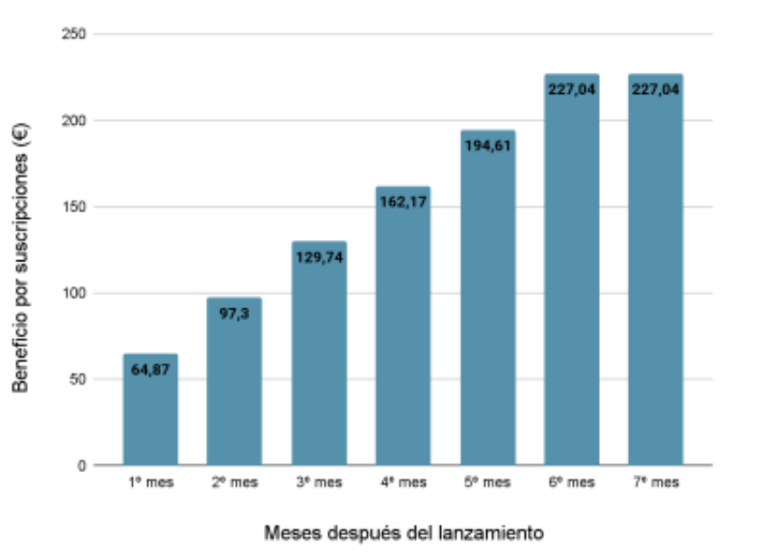
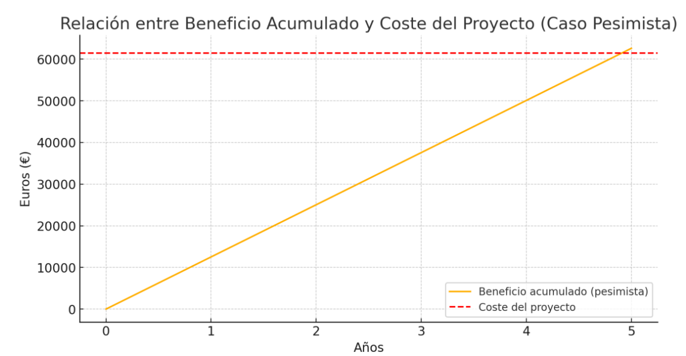

# Plantilla del Sprint 1

**Fecha:** 27/02/2025
**Grupo 8:** Infantem
**Sprint 2**

## Integrantes del Grupo

  

    <ul style="padding-left: 0; list-style: none;">
      <li>Álvaro Jiménez Osuna</li>
      <li>Ángela López Oliva</li>
      <li>Antonio Jiménez Ortega</li>
      <li>Daniel del Castillo Piñero</li>
      <li>David Fuentelsaz Rodríguez</li>
      <li>David Vargas Muñiz</li>
      <li>Enrique García Abadía</li>
      <li>Felipe Solís Agudo</li>
      <li>Javier Santos Martín</li>
    </ul>
  

    <ul style="padding-left: 0; list-style: none;">
    <li>Javier Ulecia García</li>
      <li>José García de Tejada Delgado</li>
      <li>Jose Maria Morgado Prudencio</li>
      <li>Josué Rodríguez López</li>
      <li>Lucía Noya Cano</li>
      <li>Luis Giraldo Santiago</li>
      <li>Miguel Galán Lerate</li>
      <li>Paula Luna Navarro</li>
    </ul>
  

---

## Índice

1. [Introducción](#introduccion)
2. [Estimación de Costes](#estimacion-costes)
   2.1 [Desglose de Costes de Personal](#desglose-costes-personal)
   2.3 [Desglose de Costes de Infraestructura](#desglose-costes-infraestructura)
   2.4 [Desglose de Costes de Herramientas de Desarrollo](#desglose-costes-heramientas-desarollo)
   2.5 [Desglose de Costes de Hardware y Amortización](#desglose-costes-hardware-amortizacion)
   2.6 [Desglose de Costes de Distribución y Publicación](#desglose-costes-distribucion-publicacion)
   2.7 [Costes totales](#costes-totales)
3. [Beneficios](#beneficios)
   3.1. [Modelo Freemium](#modelo-freemium)
   3.2. [Publicidad segmentada](#publicidad-segmentada)
   3.3. [Marketplace](#marketplace)
   3.4. [Suma total de beneficios](#suma-total-beneficios)
4. [Relación entre beneficio y coste del proyecto](#relacion-beneficios-costes)
5. [Costes posteriores a la fecha de lanzamiento (1 semana)](#5-costes-posteriores-a-la-fecha-de-lanzamiento-1-semana)
   5.1 [Costes de infraestructura en producción](#51-costes-de-infraestructura-en-producción)
   5.2 [Costes de atención al cliente y soporte técnico](#52-costes-de-atención-al-cliente-y-soporte-técnico)
   5.3 [Costes de herramientas y servicios de mantenimiento](#53-costes-de-herramientas-y-servicios-de-mantenimiento)
6. [Beneficios obtenidos en la primera semana](#6-beneficios-obtenidos-en-la-primera-semana)
   6.1 [6.1 Ingresos en la primera semana](#61-ingresos-en-la-primera-semana)
   6.2 [6.2 Beneficio neto en la primera semana](#62-beneficio-neto-en-la-primera-semana)
   6.3 [6.3 Análisis del resultado](#63-análisis-del-resultado)
7. [Costes Posteriores a la Fecha de Lanzamiento (6 meses y 1 año)](#7-costes-posteriores-a-la-fecha-de-lanzamiento-6-meses-y-1-año)
   7.1 [Costes de Infraestructura en Producción](#71-costes-de-infraestructura-en-producción)
   7.2 [Costes de Atención al Cliente y Soporte Técnico](#72-costes-de-atención-al-cliente-y-soporte-técnico)
   7.3 [Costes de Herramientas y Mantenimiento](#73-costes-de-herramientas-y-mantenimiento)
   7.4 [Beneficios Obtenidos](#74-beneficios-obtenidos)
   7.5 [Análisis del resultado](#75-análisis-del-resultado)
8. [Conclusiones](#8-conclusiones)

## 1. Introducción

Este documento actualiza y analiza los costes e ingresos asociados al desarrollo, lanzamiento y mantenimiento de la aplicación Infantem. Se diferencian claramente los costes de inversión (CAPEX) y los costes operativos (OPEX), así como los ingresos proyectados en escenarios pesimista, realista y optimista.

Con una media de 26.837 nacimientos al mes en España, la aplicación cuenta con un mercado potencial significativo. Se estima que un porcentaje de estos nuevos padres optará por utilizar Infantem, ya sea en su versión gratuita o mediante la suscripción premium, con un coste de 4,99 € al mes. Este documento analiza la viabilidad económica del proyecto y su potencial retorno de inversión.

## 2. Estimación de Costes

## Costes por Periodo

| Periodo            | CAPEX (€) | OPEX (€)   | TOTAL (€)     |
|--------------------|-----------|------------|----------------|
| Semana 1           | 3.796     | 12,51      | 3.808,51       |
| Semana 5           | 15.415    | 62,55      | 15.477,55      |
| Semana 10          | 30.830    | 125,10     | 30.955,10      |
| Semana 15          | 43.598    | 187,65     | 43.785,65      |
| Primeros 6 meses   | 0         | 7.935,46   | 7.935,46       |
| Primer Año         | 0         | 32.151,32  | 32.151,32      |
| Segundo Año        | 0         | 103.248,64 | 103.248,64     |

> *CAPEX:* Inversiones iniciales (desarrollo, hardware).  
> *OPEX:* Costes operativos (infraestructura, soporte, mantenimiento).

### 2.1. Desglose de Costes de Personal

En la tabla 1 se observa un desglose de los costes asociados por tener un trabajador en nómina según el rol que tenga asociado. Los datos de los salarios han sido extraídos de la página https://www.getmanfred.com, donde miles de trabajadores reflejan de manera activa sus condiciones salariales. Los datos mostrados son siempre la media que la página proporciona para cada perfil. En el caso de que algún empleado tenga asignados dos roles distintos el coste se calculará como la media aritmética de ambos roles. El coste total del está redondeado al alza a dos cifras decimales.

Las contribuciones sociales suelen variar entre el 30% y 35%. Para el cálculo se han usado la siguiente fórmula con sus respectivos valores (en todos los valores se considera el índice en lugar del porcentaje):

Contribución social = (cc + pd + cp + f + F) * sueldo bruto

- cc = Contingencias comunes (23,6%)
- pd = Prestaciones por desempleo (5,5%)
- cp = Contingencias profesionales (3,5%)
- f = Formación (0,6%)
- F = FOGASA (0,2%)

cc + pd + cp + f + F = 0,334

|                 Rol                 | Criterios de  búsqueda en  manfred                                                                                                                                   | Estimación  salario bruto anual | Estimación  salario bruto por hora | Contribuciones sociales (33,4%) | Coste total  por hora |
| :---------------------------------: | :-------------------------------------------------------------------------------------------------------------------------------------------------------------------- | :------------------------------: | :---------------------------------: | ------------------------------- | :-------------------: |
|     **Jefe de  proyecto**     | **Rol**: Project  Manager &  Delivery  Manager  **Experiencia**:  menos de dos años  **Tecnologías**:  React Native,  Spring,  Microsoft  Project |            30.800 €            |              14.81 €              | 4,94654 €                      |       19,76 €       |
|         **Frontend**         | **Rol**: Frontend  Developer **Experiencia**: menos de dos años. **Tecnologías**: React Native                                                    |            28.300 €            |              13.61 €              | 4,54574 €                      |       18,16 €       |
|          **Backend**          | **Rol:** Backend Developer  ` ` **Experiencia:** Menos de dos años  ` ` **Tecnologías:** Spring Framework                               |            28.500 €            |              13,70 €              | 4.575,8 €                      |       18,28 €       |
|        **Full-Stack**        | **Rol:** Full-Stack Developer  ` ` **Experiencia:** Menos de dos años  ` ` **Tecnologías:** Spring Framework, React Native              |            28.600 €            |              13,75 €              | 4.592,5 €                      |       18,35 €       |
| **QA e Ingeniero de Pruebas** | **Rol:** QA & Testing Engineer  ` ` **Experiencia:** Menos de dos años  ` ` **Tecnologías:** JUnit, Selenium, Nessus, Burp Suite        |            26.700 €            |              12,84 €              | 4.288,56 €                     |       17,13 €       |
|       **Documentador**       | **Rol**:  Administration **Experiencia**:  menos de dos años                                                                                             |             29700 €             |              14.28 €              | 4,76952 €                      |        19,05€        |
|         **Analista**         | **Rol**: Data  Analyst & BI  **Experiencia**:  menos de dos años                                                                                         |             26800 €             |              12.88 €              | 4,30192 €                      |       17,19 €       |

Tabla 1: Desglose del coste por rol dentro del proyecto

Para todos los trabajadores se espera un tiempo de dedicación semanal de 10 horas. Puesto que el proyecto tiene una duración conocida de 15 semanas se espera una dedicación de 150 horas totales. En la tabla 2 se refleja el coste de cada empleado según su asignación de roles. Los costes por hora se han redondeado al alza a dos cifras decimales.

| Empleado                        | Roles                                         | Coste por hora | Costes Semana 1 | Costes Semana 5 | Costes Semana 10 | Coste Semana 15 |
| ------------------------------- | --------------------------------------------- | -------------- | --------------- | --------------- | ---------------- | --------------- |
| Daniel del Castillo Piñero     | Jefe de proyecto ` `  Full-Stack         | 19.06 €       | 190,6 €        | 953,0 €        | 1.906,0 €       | 2859 €         |
| David Fuentelsaz  Rodríguez    | Backend ` `  Documentador                | 18,67 €       | 186,7 €        | 933,5 €        | 1.867,0 €       | 2800,5 €       |
| Miguel Galán Lerate            | Backend ` `  Analista                    | 17,74 €       | 177,4 €        | 887,0 €       | 1.774,0 €       | 2661 €         |
| Enrique García Abadía         | Frontend ` `  QA e Ingeniero de  pruebas | 17,65 €       | 176,5 €        | 882,5 €       | 1.765,0 €       | 2647,5€        |
| José García de Tejada Delgado | Backend ` ` QA e Ingeniero de pruebas    | 17,71 €       | 177,1 €        | 885.5 €       | 1.771,0 €      | 2656,5 €       |
| Luis Giraldo Santiago           | Jefe de proyecto ` ` Full-Stack          | 19,06 €       | 190,6 €        | 953,0 €       | 1.906,0 €      | 2859 €         |
| Antonio Jiménez Ortega         | Frontend ` ` QA e Ingeniero de pruebas   | 17,65 €       | 176,5 €        | 882,5 €       | 1.765,5 €      | 2647,5 €       |
| Álvaro Jiménez Osuna          | Frontend ` ` Analista                    | 17,68 €       | 176,8 €        | 884,0 €       | 1.768,0 €      | 2652 €         |
| Ángela López Oliva            | Frontend ` ` Documentador                | 18,61 €       | 186,1 €        | 930,5 €       | 1.861,0 €      | 2791,5 €       |
| Paula Luna Navarro              | Backend ` ` Documentador                 | 18,67 €       | 186,7 €       | 933,5 €       | 1.867,0 €      | 2800,5 €       |
| José María Morgado Prudencio  | Backend ` ` Documentador                 | 18,67 €       | 186,7 €       | 933,5 €       | 1.867,0 €      | 2800,5 €       |
| Lucía Noya Cano                | Backend ` ` Documentador                 | 18,67 €       | 186,7 €       | 933,5 €       | 1.867,0 €      | 2800,5 €       |
| Josué Rodríguez López        | Backend ` ` QA e Ingeniero de pruebas    | 17,71 €       | 177,1 €        | 885,5 €       | 1.771,0 €      | 2656,5 €       |
| Javier Santos Martín           | Frontend ` ` Analista                    | 17,68 €       | 176,8 €        | 884,0 €       | 1.768,0 €      | 2652 €         |
| Felipe Solís Agudo             | Frontend ` ` Analista                    | 17,68 €       | 176,8 €        | 884,0 €       | 1.768,0 €      | 2652 €         |
| Javier Ulecia García           | Backend ` ` Analista                     | 17,74 €       | 177,4 €       | 887,0 €        | 1.774,0 €      | 2661 €         |
| David Vargas Muñiz             | Frontend ` ` QA e Ingeniero de pruebas   | 17,65 €       | 176,5 €        | 882,5 €       | 1.765,0 €      | 2647,5 €       |
|                                 |                                               | Total:         | 3.083 €        | 15.415 €      | 30.830 €        | 43.598 €       |

Tabla 2: Desglose del coste de cada miembro

### 2.2. Desglose de Costes de Infraestructura

Los costes estimados para 15 semanas se han calculado en función de los precios oficiales de IONOS y Google Cloud Platform (GCP). El dominio Infantem.app en IONOS tiene un precio anual de 12 € ionos.com prorrateado para 15 semanas. Para el despliegue en Google App Engine, se ha considerado una instancia estándar F1 funcionando 24/7 durante 15 semanas, a un coste de 0,05 €/hora cloud.google.com.

El ancho de banda de salida se ha estimado en 50 GB, aplicando el primer GB gratuito mensual y un coste de 0,12 €/GB. Para Google Cloud Functions, se contemplaron 3 millones de invocaciones, pero debido a la capa gratuita de 2 millones por mes (7,5 millones en 15 semanas), no se generan costes.

Los backups en Google Cloud Storage se estimaron para 20 GB a 0,026 €/GB/mes. Los registros en App Engine Logs (Stackdriver) se calcularon en 10 GB adicionales tras los primeros 50 GB gratuitos, a 0,50 €/GB. Finalmente, se estimó memoria adicional para instancias, suponiendo 2 GB usados continuamente, a 0,009 €/GB/hora. Todos los cálculos se realizaron multiplicando por el número de horas, meses o GB correspondientes a las 15 semanas de uso.

| Elemento                                  | Detalle                                                | Precio unitario        | Uso estimado                          | Coste total (15 semanas) |
| ----------------------------------------- | ------------------------------------------------------ | ---------------------- | ------------------------------------- | ------------------------ |
| Dominio en IONOS                          | Infantem.app                                           | 12 €/año             | 15 semanas                            | 3,46 €                  |
| Instancias App Engine (Standard - F1)     | 0,05 €/hora - 1 instancia en funcionamiento 24/7      | 0,05 €/hora           | 24h × 7d × 15 semanas = 2.520 horas | 126,00 €                |
| Ancho de banda (Outbound traffic - 50 GB) | 0,12 €/GB; primer 1 GB/mes gratuito                   | 0,12 €/GB             | 49 GB (después del gratuito)         | 5,88 €                  |
| Google Cloud Functions                    | 0,40 €/millón de invocaciones (primer 2M gratis/mes) | 0,40 €/M invocaciones | 3M invocaciones (3,75 meses)          | 0,00 €                  |
| Google Cloud Storage (Backups - 20 GB)    | 0,026 €/GB/mes                                        | 0,026 €/GB/mes        | 20 GB × 3,75 meses                   | 1,95 €                  |
| App Engine Logs (Stackdriver)             | 0,50 €/GB (después de 50 GB gratuitos)               | 0,50 €/GB             | 10 GB adicionales                     | 5,00 €                  |
| Memoria  adicional para instancias        | 0,009 €/GB/hora                                       | 0,009 €/GB/h          | 2 GB × 2.520  horas                  | 45,36 €                 |
|                                           |                                                        |                        | Total:                                | 187,65 €                |

Tabla 3: Desglose del coste de la infraestructura

### 2.3. Desglose de Costes de Herramientas de Desarrollo

Para el desarrollo del proyecto se han seleccionado herramientas ampliamente utilizadas en la industria. Como herramienta de pago vamos a seleccionar GitHub Enterprise Plan, que actualmente está valorado en 20,15€ al mes por usuario.

| Elemento                      | Proveedor          | Detalle                              | Coste total (15 semanas) |
| ----------------------------- | ------------------ | ------------------------------------ | ------------------------ |
| Repositorio de Código        | GitHub             | Plan Enterprise (20,15€/mes)        | 1284,56 €               |
| Entorno de desarrollo (IDE)   | VS Code            | Gratuito                             | 0 €                     |
| CI/CD (Integración continua) | GitHub Actions     | Gratuito (uso limitado 2000 min/mes) | 0 €                     |
| Spring Boot                   | VMWare             | Gratuito                             | 0 €                     |
| React Native                  | Meta               | Gratuito                             | 0 €                     |
| MySQL                         | Oracle Corporation | Licencia GPL                         | 0 €                     |
|                               |                    | Total:                               | 1284,56 €               |

Tabla 4: Desglose del coste de las herramientas de desarrollo

### 2.4. Desglose de Costes de Hardware y Amortización

Para el desarrollo del proyecto, se ha seleccionado el Lenovo IdeaPad Slim 3 15IRH8, un portátil que ofrece un equilibrio óptimo entre rendimiento y coste.

Actualmente, este portátil está disponible en MediaMarkt por un precio de 629 € por unidad. Para realizar los cálculos hemos supuesto una vida útil de 3 años. Para la amortización mensual de cada equipo se ha dividido el coste por equipo entre la vida útil (en meses). La amortización total se ha obtenido multiplicando la amortización mensual por equipo por el número de meses (3,75) y el número de equipos.

|                    Elemento | Vida útil  estimada | Número de equipos | Coste por equipo | Amortizaci ón  mensual  por equipo | Amortizaci ón total  (15  semanas) | Coste total |
| --------------------------: | :------------------: | :----------------: | :--------------: | :---------------------------------: | :---------------------------------: | :---------: |
| Lenovo  IdeaPad  Slim 3 Gen |       3 años       |         17         |      629 €      |              17,47 €              |             1.113,85 €             |  10.693 €  |

Tabla 5: Desglose del coste del hardware

### 2.5. Desglose de Costes de Distribución y Publicación

Se ha elegido Google Play Store y Apple App Store para distribuir la aplicación, debido a su amplio alcance y facilidad de acceso en dispositivos Android e iOS, respectivamente.

- En el caso de Google Play Store, el único coste asociado es el registro de desarrollador, con un pago único de 23,98 €, que permite gestionar y publicar la aplicación durante todo el periodo del proyecto.
- Para Apple App Store, se requiere una suscripción anual al programa de desarrolladores de Apple, con un coste de 99 USD anuales. Dado que el proyecto tiene una duración de 15 semanas, se considerará el coste total de 99 USD (aproximadamente 94,97 € al tipo de cambio actual) https://developer.apple.com/la/support/compare-memberships/.

| Elemento          | Proveedor | Detalle                   | Coste total            |
| ----------------- | --------- | ------------------------- | ---------------------- |
| Google Play Store | Google    | Registro de desarrollador | 23,98 € (pago único) |
| Apple App Store   | Apple     | Apple Developer Program   | 94,97 €               |
|                   |           | **Total**           | **118,95 €**    |

Tabla 6: Desglose de costes de distribución

### 2.6. Costes de Expertos (nutricionistas)

Se ha de tener en cuenta el coste de contrartacion de expertos en el ambito de la nutricion para la elabroracion de las recetas presonalizadas y recomendaciones nutricionales. De media en España un nutricionista por consulta cobra un total de 60 €, con una duracion por consulta de 60 min aproximadamente. Con estos datos podemos suponer que realizaremos un total de 3 consultas semanales durante las primeras 15 semanas para obtener la informacion necesaria para las recomendaciones y las recetas personalizadas.

|             | Coste por consulta | Semana 1 | Semana 5 | Semana 10 | Semana 15 |
| ----------- | ------------------ | -------- | -------- | --------- | --------- |
| Coste total | 60 €              | 180 €   | 900 €   | 1.800€   | 2.700 €  |

### 2.7. Costes totales

En la siguiente tabla se recogen los costes totales del proyecto, incluyendo en el precio total un 10% de reservas de contingencia

| Categoría                                                             | Costes                  |
| ---------------------------------------------------------------------- | ----------------------- |
| Costes de personal                                                     | 43.598 €               |
| Costes de Infraestructura                                              | 187,65 €               |
| Costes de Herramientas de Desarrollo                                   | 1.284,56 €             |
| Costes de Hardware y Amortización                                     | 10.693 €               |
| Costes de Publicación y Distribución                                 | 118,95 €               |
| Costes de Expertos (nutricionistas)                                    | 2.700 €                |
| **Total**                                                        | **58.582,16 €**  |
| **Coste del proyecto (total + 10% de reserva de contingencias)** | **64.170,376 €** |

Tabla 7: desglose de costes del proyecto

## 3. Ingresos

Para el cálculo de los ingresos se tendrán en cuenta un caso optimista y un caso pesimista de adopción del sistema cómo se expondrán en los siguientes puntos. Estos casos se basan en el número de nacimientos medio por mes según el INE en 2024, siendo esta cifra de 26837. Infantem cuenta con cuatro maneras distintas de monetización.

### 3.1. Modelo Freemium

La aplicación cuenta con funcionalidades básicas que son de uso gratuito para todos los usuarios. Sin embargo, también ofrece un plan Premium que ofrece funcionalidades extra. Dicho plan tiene un precio de 4,99 €. En estos datos no se descuenta el IVA.

- Caso pesimista
  - Un 1% de los padres con un hijo recién nacido utiliza Infantem, que se traduce en 268 usuarios. Si de este número un 5% (13 personas) adquieren el plan Premium se conseguiría unos ingresos de 64,87 € el primer mes. Suponiendo también que la mitad de los usuarios continúa con la suscripción durante 6 meses queda la distribución por mes que se puede ver en el gráfico 1. Estos datos indican que los ingresos totales por suscripciones en un año sería de 2237,97 € sin descontar el IVA y 1767,99 € si se descuenta.
- Caso Realista
  - Un 5% de los padres con un hijo recién nacido utiliza Infantem, que se traduce en 1342 usuarios. Si de este número un 7% (94 personas) adquieren el plan Premium, se conseguiría unos ingresos de 469,06 € el primer mes. Suponiendo también que la mitad de los usuarios continúa con la suscripción durante 6 meses, queda la distribución por mes que se puede ver en el gráfico correspondiente. Estos datos indican que los ingresos totales por suscripciones en un año sería de 5628,72 € sin descontar el IVA y 21.027,52 € tras IVA.

Gráfico 1: Distribución de INGRESOS por meses después del lanzamiento

- Caso optimista
  - Un 10% de los padres con un recién nacido utiliza la aplicación, que se traduce en 2683 usuarios. Si un 10% de ellos (268) adquieren el plan Premium se conseguiría unos ingresos de 1337,32 € el primer mes. Suponiendo que la mitad de los usuarios mantiene el plan durante un año queda la distribución por mes que se puede ver en el gráfico 2. Estos datos indican que los ingresos totales por suscripciones en un año sería de 60179,4 € con IVA y 47541,72 € al descontar el IVA.

Gráfico 2: Distribución de INGRESOS por meses después del lanzamiento

### 3.2. Publicidad segmentada

Para los usuarios que no dispongan de plan premium tendrán publicidad en la aplicación orientada siempre a productos infantiles. Se asume que se tendrá un CPM (Costo por Mil Impresiones) de 2 euros y que un usuario accede de media a la aplicación 5 veces al día. Nuevamente se presenta un caso optimista y uno pesimista, para

- Caso pesimista
  - Nuevamente se asume que un 1% (268) de los padres con hijos recién nacidos usa Infantum y que el 95% (255) de ellos tiene el plan gratuito. Si durante un año utilizan la aplicación significa que cada uno ha visto 1825 anuncios, haciendo un total de 465375 visualizaciones de anuncios. Este número se traduce a su vez en 465 paquetes de 1000 visualizaciones, generando así 930 € anuales. No obstante, a esta cantidad hay que restarle en torno a un 15% (si factura menos de un millón de euros) de comisión por la plataforma en la que se aloja la aplicación y un 21% de IVA, quedando 595,2 €.
- Caso Realista
  - Se asume que un 5% (1342 usuarios) de los padres con hijos recién nacidos usa Infantem y que el 92% (1234 usuarios) tiene el plan gratuito. Si durante un año utilizan la aplicación, cada uno verá 1825 anuncios, lo que resulta en 2.251.450 visualizaciones de anuncios. Este número equivale a 2251 paquetes de 1000 visualizaciones, generando así 4502 € anuales. Tras restar aproximadamente un 15% de comisión de la plataforma y un 21% de IVA, el ingreso anual neto se sitúa en 3.042,8 €.
- Caso optimista
  - Nuevamente se asume que un 10% (2683) de los padres con hijos recién nacidos usa Infantum y que el 90% (2414) de ellos tiene el plan gratuito. Si durante un año utilizan la aplicación significa que cada uno ha visto 1825 anuncios, haciendo un total de 4405550 visualizaciones de anuncios. Este número se traduce a su vez en 4405 paquetes de 1000 visualizaciones, generando así 8810€ anuales. Restándole a esta cantidad las comisiones y el IVA se obtiene un ingreso anual de 5638,4 €.

### 3.3. Marketplace

Infantem contará con un marketplace especializado en productos para bebés, donde terceros podrán ofrecer artículos relacionados con la alimentación infantil, higiene, ropa, juguetes educativos y otros productos de interés para los padres. La monetización de este marketplace se basará en comisiones por cada venta realizada a través de la plataforma.

Al igual que en los modelos anteriores, se plantean dos escenarios para el análisis de ingresos: un caso optimista y un caso pesimista. Se ha considerado un ticket medio de compra de 40 € por usuario y una comisión del 10% por cada venta, sin descontar el IVA.

- Caso pesimista

  - En este escenario, se asume que un 1% de los padres con un hijo recién nacido utiliza el marketplace de Infantem, lo que equivale a 268 usuarios. Se presupone que cada usuario realiza una compra mensual con un valor medio de 40 €. Esto se traduce en unas ventas totales mensuales de 10.720 €. Dado que Infantem obtiene una comisión del 10% por cada venta, se generaría un ingreso mensual de 1.072 €.
    Si consideramos que este volumen de ventas se mantiene constante durante todo el año, el ingreso anual antes de aplicar el IVA sería de 12.864 €. Tras descontar el 21% de IVA, el ingreso anual se situaría en 10.158,56 €.
- Caso Realista

  - En este escenario, se asume que un 5% de los padres con un hijo recién nacido (1342 usuarios) utiliza el marketplace de Infantem. Se estima que cada usuario realiza 1,5 compras al mes con un valor medio de 40 € cada una.Esto resulta en unas ventas totales mensuales de 80.520 €. Aplicando la comisión del 10%, el ingreso mensual sería de 8.052 €. Si este volumen de ventas se mantiene durante todo el año, el ingreso anual antes de IVA sería de 96.624 €. Tras descontar el 21% de IVA, el ingreso neto anual alcanzaría 76.331 €.
- Caso optimista

  - En un escenario más favorable, se estima que un 10% de los padres con un hijo recién nacido utiliza el marketplace de Infantem, lo que se traduce en 2.683 usuarios. Se plantea que cada usuario realiza dos compras al mes, con un valor medio de 40 € cada una. Esto daría lugar a unas ventas totales mensuales de 214.640 €.
    Aplicando la comisión del 10%, el ingreso mensual ascendería a 21.464 €. Manteniendo este ritmo de ventas durante un año, se obtendría un ingreso anual antes de IVA de 257.568 €. Tras descontar el 21% de IVA, el ingreso anual alcanzaría los 203.479,72 €.

### 3.4. Suma total de ingresos

En este apartado se presentan los ingresos totales combinados de todas las formas de monetización expuestas anteriormente (modelo Freemium, publicidad segmentada y marketplace), distinguiendo entre el caso optimista y el caso pesimista

### Escenarios de ingresos: Optimista, Realista y Pesimista

| Periodo            | Optimista (€) | Realista (€) | Pesimista (€) |
|--------------------|----------------|----------------|-----------------|
| Semana 1 a 15      | 0              | 0              | 0               |
| Semana 16          | 3.708,35       | 1.762,82       | 686,62          |
| Primeros 6 meses   | 167.747,43     | 85.053,18      | 16.502,64       |
| Primer Año         | 256.659,84     | 340.853,76     | 12.521,75       |
| Segundo Año        | 513.319,68     | 681.707,52     | 25.043,50       |

> Los ingresos están divididos en tres fuentes:  
> *Freemium (suscripciones premium), **Publicidad segmentada, y **Marketplace*.

**Caso pesimista**

- **Modelo Freemium**: 1.767,99 € anuales (tras IVA)
- **Publicidad segmentada**: 595,2 € anuales (tras IVA)
- **Marketplace**: 10.158,56 € anuales (tras IVA)
  **Ingresos totales anual en el caso pesimista**: 12.521,75 €

**Caso Realista**

- **Modelo Freemium**: 21.027,52 € anuales (tras IVA)
- **Publicidad segmentada**: 3.042,8 € anuales (tras IVA)
- **Marketplace**: 76.331 € anuales (tras IVA)
  **Ingresos totales anual en el caso pesimista**: 100.401,32 €

**Caso optimista**

- **Modelo Freemium**: 47.541,72 € anuales (tras IVA)
- **Publicidad segmentada**: 5.638,4 € anuales (tras IVA)
- **Marketplace**: 203.479,72 € anuales (tras IVA)
  **Ingresos totales anual en el caso optimista**: 256.659,84 €

## 4. Relación entre ingresos y coste del proyecto (beneficios)

Finalmente, se analiza la relación entre los ingresos estimados y los costes del proyecto. Según la tabla de desglose de costes (Tabla 4), el coste total del proyecto, incluyendo un 10% de reserva para contingencias, es de 61.470,376 €.

**Caso pesimista**

Con un beneficio total anual estimado de 12.521,75 €, el tiempo estimado para recuperar la inversión inicial (punto de equilibrio) sería de aproximadamente 5 años si se mantiene este escenario.

Gráfico 3: Relación entre ingresos acumulados y coste del proyecto caso pesimista

**Caso Realista**

Con unos ingresos totales anuales estimado de 100.401,32 €, el tiempo estimado para recuperar la inversión inicial de 61.470,38 € sería de aproximadamente 8 meses si se mantiene este escenario.

Este caso representa un punto de equilibrio más accesible que el pesimista (5 años) pero más conservador que el optimista (3 meses), mostrando una viabilidad intermedia del proyecto.

**Caso optimista**

Con uno ingresos totales anuales estimado de 256.659,84 €, la inversión se recuperaría en menos de un año (aproximadamente 3 meses), generando beneficios netos rápidamente.

Gráfico 4: Relación entre ingreso acumulado y coste del proyecto caso optimista

## 5. Costes posteriores a la fecha de lanzamiento (1 semana)

Una vez establecidos los costes que tendrán lugar durante toda la fase de desarrollo, es necesario establecer los costes que incurrirán durante, al menos, una semana después del lanzamiento de nuestra aplicación. Para ello tendremos en cuenta a 1352 usuarios, teniendo en cuenta el caso realista. Podemos dividir estos costes en distintos tipos:

### 5.1 Costes de infraestructura en producción

Estos costes provienen del uso de servidores, bases de datos, almacenamiento y tráfico generado por los usuarios.

#### **Infraestructura en la primera semana**

#### **Hosting y servidores (Google Cloud)**

**Instancias Compute Engine (e2-standard-2)**

- **Costes:** 0,0676 €/hora
- **Cálculo:** 2 instancias funcionando 24h x 7 días = 168 horas
- **Total:** 22,72 €

#### **Ancho de banda (Datos enviados a los usuarios)**

- **Costes:** 0,12 €/GB (primer GB gratis)
- **Estimación:** Cada usuario genera en promedio 50 MB/día, lo que equivale a **(1.342 usuarios × 50 MB × 7 días) / 1.024 ≈ 458 GB**
- **Total:** 54,84 €

#### **Google Cloud Storage (Backup - 50 GB)**

- **Costes:** 0,020 €/GB/mes
- **Para 1 semana:** 0,020 × (50 GB ÷ 4)
- **Total:** 0,25 €

#### **Logging y monitoreo (Cloud Logging - Stackdriver)**

- **Costes:** 0,50 €/GB después de 50 GB gratuitos
- **Estimación:** 5 GB adicionales
- **Total:** 2,50 €

#### **Memoria adicional para Servidor**

- **Costes:** 0,009 €/GB/hora
- **Cálculo:** 4 GB × 168 horas
- **Total:** 6,05 €

---

### **Total Infraestructura: 86,36 €**

---

### 5.2 Costes de atención al cliente y soporte técnico

Estos costes incluyen la atención al usuario, solución de problemas, respuesta a tickets, etc.

#### **Soporte técnico y atención al cliente**

- **Horas de soporte estimadas:** 2 personas atendiendo tickets y dudas (40 h/semana)
- **Costo por hora (QA/Documentación):** 17,5 €/h
- **Total:** 700 €

---

### 5.3 Costes de herramientas y servicios de mantenimiento

Utilizaremos estas herramientas para monitorear, analizar y gestionar la aplicación.

#### **Monitorización (Google Cloud Monitoring)**

- **Estimación:** 10 €/semana

#### **Automatización y bots de soporte (Chatbots)**

- **Uso estimado:** Gratis en primeras semanas con planes básicos
- **Total:** 0 €

---

### **Total Herramientas y Mantenimiento: 10 €**

---

## **Coste total de la primera semana post-lanzamiento:**

### **796,36 €**

## 6. Beneficios obtenidos en la primera semana

Para calcular los beneficios en la primera semana tras el lanzamiento, consideramos los ingresos obtenidos a partir de nuestras tres fuentes de monetización principales: **modelo Freemium (suscripciones Premium), publicidad segmentada y marketplace**. Luego, comparamos estos ingresos con los costes operativos de la semana.

---

### **6.1 Ingresos en la primera semana**

#### **a) Ingresos por suscripciones Premium**

Siguiendo el caso realista, **94 usuarios** adquieren el plan Premium por **4,99 €** al mes.

- **Ingresos mensuales**:
  - 94 × 4,99 € = **469,06 €**
- **Ingresos semanales**:
  - 469,06 € ÷ 4 ≈ **117,27 €**

---

#### **b) Ingresos por publicidad segmentada**

En el caso realista, **1.234 usuarios** entran a la app con la versión gratuita y ven anuncios.Estimamos que cada usuario ve **5 anuncios al día**, lo que suma **35 anuncios por semana**.

- **Total de visualizaciones semanales**:
  - 1.234 usuarios × 35 anuncios = **43.190 visualizaciones**
- **CPM (Costo por Mil Impresiones)** = **2 €/1000 visualizaciones**
- **Ingresos semanales por publicidad**:
  - (43.190 ÷ 1000) × 2 € ≈ **86,38 €**
- **Ingresos netos tras comisiones e IVA (-36%)**:
  - 86,38 € × 0,64 = **55,28 €**

---

#### **c) Ingresos por Marketplace**

Se estima que **1.342 usuarios** utilizan el marketplace. Cada usuario realiza **1,5 compras al mes** con un ticket medio de **40 €**.

- **Ventas mensuales totales**:
  - 1.342 × 1,5 × 40 € = **80.520 €**
- **Comisión del 10%**:
  - 80.520 € × 0,10 = **8.052 €**
- **Ingresos semanales**:
  - 8.052 € ÷ 4 ≈ **2.013 €**
- **Ingresos netos tras IVA (-21%)**:
  - 2.013 € × 0,79 ≈ **1.590,27 €**

---

### **6.2 Beneficio neto en la primera semana**

Ahora restamos los costes operativos a los ingresos generados en la primera semana.

| Concepto                        | Ingresos (€)         | Costes (€)         |
| ------------------------------- | --------------------- | ------------------- |
| **Suscripciones Premium** | 117,27 €             | —                  |
| **Publicidad segmentada** | 55,28 €              | —                  |
| **Marketplace**           | 1.590,27 €           | —                  |
| **Total ingresos**        | **1.762,82 €** | **796,36 €** |
| **Beneficio neto**        | **966,46 €**   | —                  |

---

### **6.3 Análisis del resultado**

En la **primera semana**, generaríamos un **beneficio neto de 966,46 €**.

Este resultado muestra que, aunque el modelo Freemium por sí solo no cubriría los costes operativos en la primera semana, la combinación con publicidad y el marketplace hace que la aplicación sea rentable desde el inicio.

**Conclusiones clave:**

- El **Marketplace** es la mayor fuente de ingresos, representando **90%** del beneficio semanal.
- **La publicidad y las suscripciones Premium aún no cubren por sí solas los costes**, pero pueden crecer con más usuarios activos.
- La **rentabilidad se mantiene si la base de usuarios se mantiene y crece con el tiempo**.

Si se mantiene esta tendencia, **el beneficio mensual estimado sería de 3.865,84 €**, lo que confirma que podemos generar ingresos sostenibles y escalar.

## 7. Costes Posteriores a la Fecha de Lanzamiento (6 meses y 1 año)

A medida que la base de usuarios de nuestra aplicación crece, los costes de infraestructura, soporte y mantenimiento también aumentarán proporcionalmente. Se calcula el impacto financiero a **6 meses** y **1 año** después del lanzamiento, asumiendo un crecimiento realista en el número de usuarios.

En este escenario, la aplicación crece a un **15% mensual**, lo que resulta en:

- **Usuarios a los 6 meses**: 2.692
- **Usuarios al año**: 5.392
- **Usuarios a los 2 años**: 11.278

---

### 7.1 Costes de Infraestructura en Producción

Los costes de servidores, almacenamiento y tráfico aumentan en función del crecimiento de usuarios.

#### **Hosting y Servidores (Google Cloud - Compute Engine e2-standard-2)**

- **Cálculo**: 2 instancias al inicio, aumentando a 4 instancias a los 6 meses y a 8 instancias al año.
- **Total 6 meses**: 45,44 €/mes → **272,64 €**
- **Total 12 meses**: 90,88 €/mes → **1.090,56 €**
- **Total 24 meses:** 90,88 €/mes → **2181,12 €**

#### **Ancho de Banda (Datos Enviados a los Usuarios)**

- **Cálculo**: 50 MB/día por usuario
- **Total 6 meses**: (2.692 usuarios × 50 MB × 30 días) ÷ 1.024 × 0,12 €/GB = **265,97 €/mes → 1.595,82 €**
- **Total 12 meses**: (5.392 usuarios × 50 MB × 30 días) ÷ 1.024 × 0,12 €/GB = **532,73 €/mes → 1.595,82 € + 532,73 € x 6 meses → 4.738,20 €**
- **Total 24 meses**: (11.278 usuarios × 50 MB × 30 días) ÷ 1.024 × 0,12 €/GB =  **1.637,13 €/mes → 4.738,20 € + 1.637,13 € x 12 meses → 24.383.76 €**

#### **Google Cloud Storage (Backup - 100 GB en 6 meses, 200 GB al año)**

- **Total 6 meses**: 2 €/mes → **12 €**
- **Total 12 meses**: 4 €/mes → 12 € + 4 € x 6 meses → **36 €**
- **Total 12 meses**: 8 €/mes → 36€ + 8 € x 12 meses → **132** **€**

#### **Logging y Monitoreo (Cloud Logging - Stackdriver)**

- **Total 6 meses**: 5 GB adicionales por mes → 2,50 €/mes → **15 €**
- **Total 12 meses**: 10 GB adicionales por mes → 5 €/mes →  15 € + 5 € x 6 meses **→ 45 €**
- **Total 24 meses**: 15 GB adicionales por mes → 7,50 €/mes →  45 € + 7,5 € x 12 meses **→ 135 €**

---

### 7.2 Costes de Atención al Cliente y Soporte Técnico

Con más usuarios, se requiere más soporte. Se aumenta el equipo de atención al cliente progresivamente.

- **6 meses**: 2 empleados (40 h/semana por empleado) → **2 empleados** × **3**,**031 €/mes** × **6 meses**=**36**,**372** €
- **12 meses**: 4 empleados (40 h/semana por empleado) → **36**,**372** + **4** × **3**,**031** × **6**=**109**,**116** €
- 24 meses : 8 empleados (40h/semana por empleado) → 109,116 + (6 x 3,031 x 12) = 109,116 + 218,232 = 327,348 €

---

### 7.3 Costes de Herramientas y Mantenimiento

- **Monitorización (Google Cloud Monitoring)**

  - 6 meses: 40 €/mes → **240 €**
  - 12 meses: 40 €/mes → **480 €**
  - 24 meses: 40 €/mes → **960 €**
- **Automatización y Chatbots**

  - 6 meses: Plan estándar → **50 €/mes → 300 €**
  - 12 meses: Plan avanzado → **100 €/mes → 1.200 €**

---

### **Coste Total en 6 Meses**: **7.935,46 €**

### **Coste Total en 2 Años:**

### **Coste Total en 1 Año**: **32.151,32 €**

---

## 7.4 Beneficios Obtenidos

### **7.4.1 Ingresos a los 6 Meses**

#### **a) Ingresos por Suscripciones Premium**

Usuarios premium creciendo al 7% del total:

- **Usuarios premium**: 188
- **Ingresos mensuales**: 188 × 4,99 € = **937,12 €**
- **Ingresos totales en 6 meses**: **5.622,72 €**

---

#### **b) Ingresos por Publicidad Segmentada**

- **Visualizaciones totales**: (2.692 × 35 anuncios × 4 semanas) = **376.880 visualizaciones**
- **CPM** = 2 €/1000 visualizaciones
- **Ingresos mensuales**: (376.880 ÷ 1.000) × 2 € = **753,76 €**
- **Ingresos netos tras comisiones e IVA (-36%)**: **482,41 €/mes → 2.894,46 € en 6 meses**

---

#### **c) Ingresos por Marketplace**

- **Ventas mensuales totales**: 2.692 × 1,5 × 40 € = **161.520 €**
- **Comisión del 10%**: **16.152 €/mes → 96.912 € en 6 meses**
- **Ingresos netos tras IVA (-21%)**: **12.756 €/mes → 76.536 € en 6 meses**

---

### **7.4.2 Beneficio Neto en 6 Meses**

| Concepto                        | Ingresos (€)          | Costes (€)           |
| ------------------------------- | ---------------------- | --------------------- |
| **Suscripciones Premium** | 5.622,72 €            | —                    |
| **Publicidad Segmentada** | 2.894,46 €            | —                    |
| **Marketplace**           | 76.536 €              | —                    |
| **Total Ingresos**        | **85.053,18 €** | **7.935,46 €** |
| **Beneficio Neto**        | **77.117,72 €** | —                    |

---

### **7.4.3 Beneficios al Año**

#### **a) Ingresos por Suscripciones Premium**

Usuarios premium creciendo al 7% del total:

- **Usuarios premium**: 377
- **Ingresos mensuales**: 377 × 4,99 € = **1.880,23 €**
- **Ingresos totales en 12 meses**: **22.562,76 €**

---

#### **b) Ingresos por Publicidad Segmentada**

- **Visualizaciones totales**: (5.392 × 35 × 4) = **754.880 visualizaciones**
- **CPM** = 2 €/1000 visualizaciones
- **Ingresos mensuales**: (754.880 ÷ 1.000) × 2 € = **1.509,76 €**
- **Ingresos netos tras comisiones e IVA (-36%)**: **966,25 €/mes → 11.595 € en 12 meses**

---

#### **c) Ingresos por Marketplace**

- **Ventas mensuales totales**: 5.392 × 1,5 × 40 € = **323.520 €**
- **Comisión del 10%**: **32.352 €/mes → 388.224 € en 12 meses**
- **Ingresos netos tras IVA (-21%)**: **25.558 €/mes → 306.696 € en 12 meses**

---

### **7.4.4 Beneficio Neto en 1 Año**

| Concepto                        | Ingresos (€)           | Costes (€)            |
| ------------------------------- | ----------------------- | ---------------------- |
| **Suscripciones Premium** | 22.562,76 €            | —                     |
| **Publicidad Segmentada** | 11.595 €               | —                     |
| **Marketplace**           | 306.696 €              | —                     |
| **Total Ingresos**        | **340.853,76 €** | **32.151,32 €** |
| **Beneficio Neto**        | **308.702,44 €** | —                     |

---
## Análisis de Rentabilidad

- La inversión inicial (CAPEX) asciende a 43.598 €.
- El punto de equilibrio se alcanza:
  - En *3 meses* en el escenario optimista.
  - En *8 meses* en el escenario realista.
  - En *5 años* en el escenario pesimista.
- A partir del lanzamiento, todos los costes son OPEX, centrados en infraestructura y soporte.
- El *Marketplace* es el mayor generador de ingresos en todos los escenarios.

### 7.5 **Análisis del resultado**

- A los **6 meses**, obtendríamos un **beneficio neto de 77.117,72 €**.
- A los **12 meses**, el beneficio neto asciende a **308.702,44 €**, demostrando un crecimiento exponencial.
- El **Marketplace** sigue siendo la mayor fuente de ingresos, representando un **90% del beneficio total**.
- La **publicidad y suscripciones** continúan en aumento, pero aún no son el pilar principal de la monetización.
- Los costes operativos se incrementan, pero el crecimiento de ingresos los supera ampliamente, consolidando la rentabilidad del negocio.

## 8. Conclusiones

El análisis actualizado confirma que Infantem es viable económicamente y puede generar beneficios desde los primeros meses si se logra una base de usuarios significativa. Su modelo escalable, basado en ingresos recurrentes y bajo CAPEX tras el lanzamiento, permite una expansión sostenida y rentable.